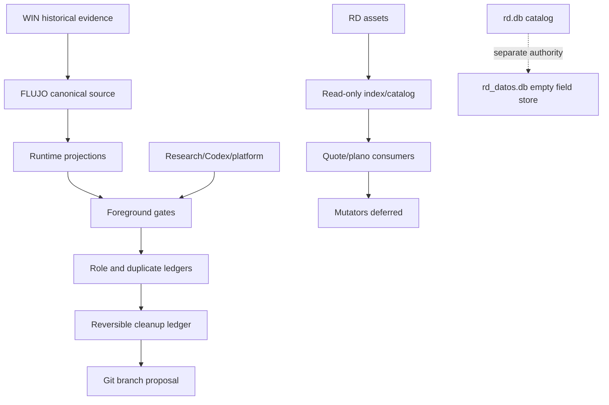

# Phase 202 — MAK integration progress visual

Status: `CURRENT_SNAPSHOT`



## 13-objective status

| Status | Count | Items |
|---|---:|---|
| Gated/integrated | 5 | RD asset/index path, Research owner, Codex owner, platform pure projections, read-only RD/quote/plano consumers |
| Classified/proposed | 4 | folder architecture, dependency slices, paused automation, duplicate/tool role matrices |
| Open/deferred | 4 | field data authority, mutating routes, destructive cleanup, Git branch system |

## What is already solid

- The Windows migration target is no longer treated as active runtime: `WIN`
  is historical evidence only.
- Research and Codex have one canonical semantic owner plus tested runtime
  projections; wrapper import boundaries were fixed.
- RD has 1,742 regular files reconciled by path/size/mtime to its local index;
  exact duplicates have role candidates, not deletion decisions.
- `rd.db` is the catalog projection; `rd_datos.db` is valid and empty field
  data. They are deliberately separate.
- Apps, MobileCLIP, n8n and XIO are no longer confused with the core migration:
  apps/source stay external, n8n is discarded, XIO is excluded.
- All checked user services are inactive; relevant crontab lines are paused.

## Remaining sequence

```text
role matrices
    -> final cleanup ledger with hashes + consumers + rollback
    -> one reversible candidate at most
    -> full local validation
    -> visual/status review
    -> Git branch proposal
```

No filesystem cleanup, database merge, provider execution or Git branch work
is included in this snapshot.
