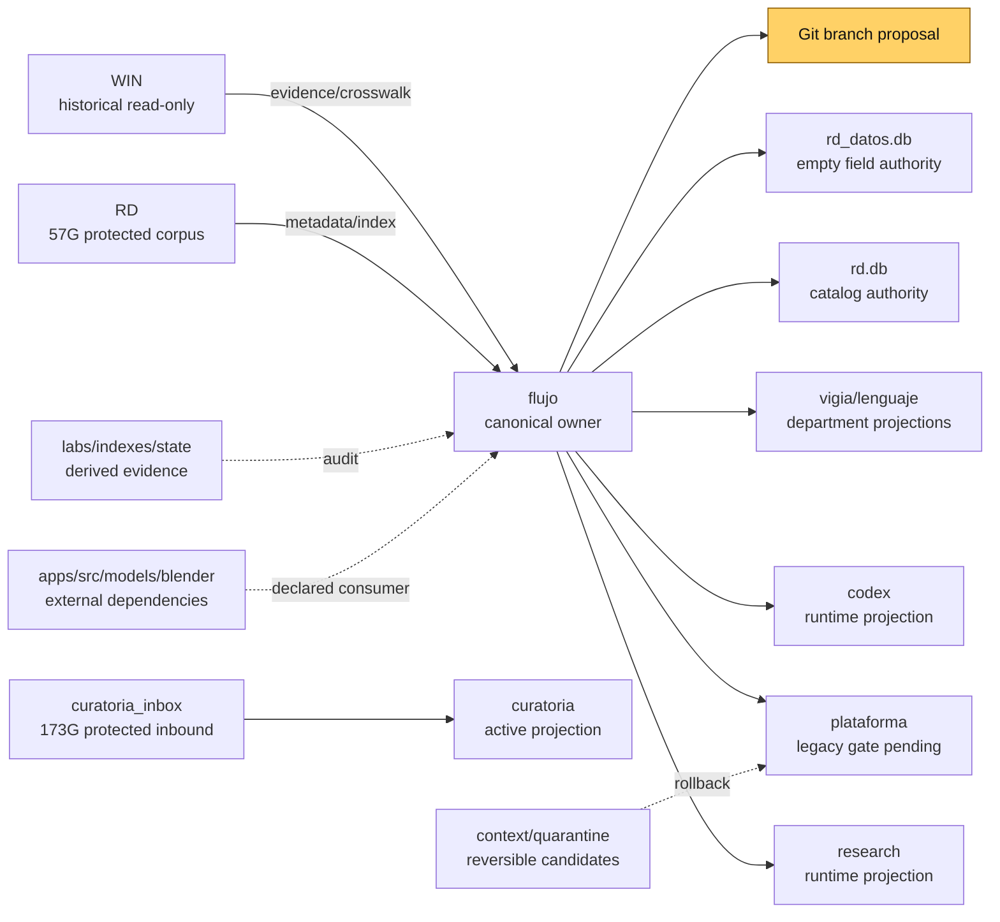
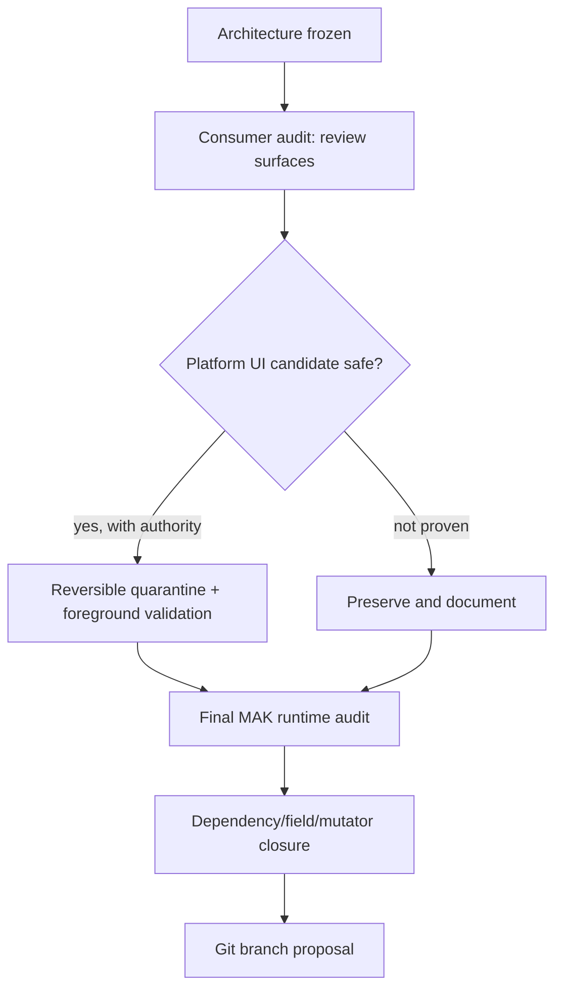

# Phase 210 — visual closeout snapshot

Date: 2026-08-15 (America/Santiago)

## House map



## Objective status

```text
1 RD field data                 OPEN / DEFERRED
2 RD database relationship     GATED / SEPARATE AUTHORITIES
3 RD mutating routes           DEFERRED / AUTHORITY GATE
4 FLUJO automations            CLASSIFIED / USER WORKFLOW CONFIRMED
5 non-serve CLI                GATED PARTIAL / READS PASS, WRITES DEFERRED
6 RD asset surface             INTEGRATED / INDEX RECONCILED
7 dependencies by slice       CLASSIFIED PARTIAL
8 final folder architecture   FROZEN / NO BROAD MOVES
9 duplicate documents          LEDGERED / PRESERVE BY PROVENANCE
10 equivalent tools            ROLE-MAPPED / CONSUMER FUSION PENDING
11 complete MAK audit          IN PROGRESS
12 confirmed junk              PENDING / NO ROOT ITEM CLEARED
13 Git branch system           LAST / NOT APPLIED
```

## Remaining path



The architecture is now physically grounded, but the final state is not yet
complete: field-data authority, mutating routes, remaining consumer audits,
cleanup approval and Git branch design still remain.

