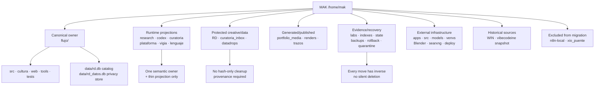
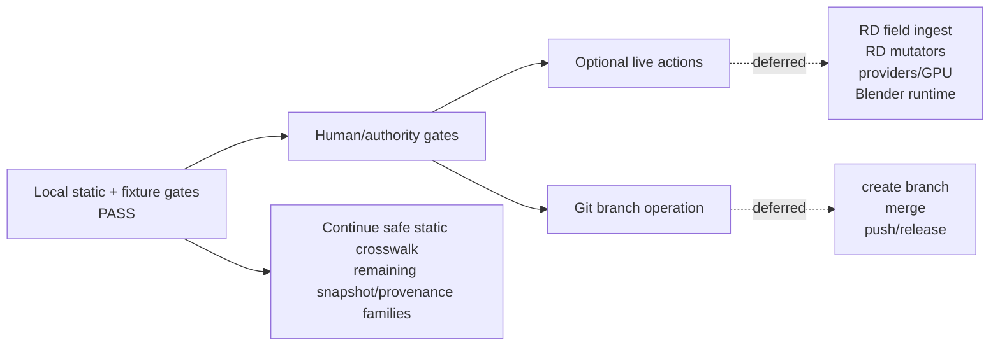

# Phase 282 — visual architecture closeout and branch alignment

Date: 2026-08-15 America/Santiago  
Owner: LUNA principal  
Status: `VISUAL_CLOSEOUT_READY; NO_GIT_OPERATION`

## The house at a glance



## Operating rule

Similar names, Spanish/English variants, timestamps or identical hashes make a
candidate visible; they do not authorize fusion. A tool is fused only when it
has one semantic owner, a named consumer, a declared platform/language
boundary, a foreground test and a rollback. A document or SVG is fused only
when provenance and output semantics agree. Databases remain physically
separate when their lifecycle/privacy roles differ.

## What is already ordered

| Layer | Current result |
|---|---|
| Canonical FLUJO | Active source, CLI, hub, tests and context are under `/home/mak/flujo` |
| Runtime departments | Consumer-backed projections retained; exact owners/crosswalks recorded |
| RD catalog/privacy | `rd.db` merged catalog; empty `rd_datos.db` remains separate |
| Language | Root `/home/mak/lenguaje` retained as load-bearing runtime/data projection |
| SVG/source corpus | `trazos` retained; ISKVW published projection indexed separately |
| Historical full snapshots | WIN and vibecodeine preserved; no whole-tree merge |
| External infrastructure | Deploy, Blender, models, providers and search config retained/gated |
| Confirmed cleanup | Evidence-preserving quarantines only; Phase 270 UI move has inverse |
| Automation | Event bridge user-confirmed but paused; cron active count 0; n8n/XIO excluded |

## Remaining gates, not missing architecture



Open gates are explicit: RD field privacy/date/authority, live mutator
authority, optional providers/GPU/Blender, and Git operation authority. They
are not reasons to delete or flatten historical material.

## Branch alignment (proposal only)

```text
main
  <- codex/mak/architecture
  <- codex/mak/deps
  <- codex/mak/rd-catalog + codex/mak/flujo-cli
  <- codex/mak/departments/<name>
  <- codex/mak/rd-field        [authority required]
  <- codex/mak/rd-routes       [authority required]
  <- codex/mak/automation      [external gate]
  <- codex/mak/cleanup/<phase> [rollback + foreground proof]
  <- codex/mak/release/<version>
```

The first branch, if explicitly authorized, is
`codex/mak/architecture`; it owns only architecture maps, crosswalks, visual
status and ledgers. Each department branch names its `LUNA-N`/phase predecessor
and successor in the handoff. No branch, checkout, merge, reset or push was
performed.

## Final cleanup order

1. Preserve WIN, databases, media, credentials, generated products and
   evidence.
2. Keep one canonical owner plus consumer-backed runtime projections.
3. Build provenance crosswalks for exact/semantic duplicate document and SVG
   families.
4. Quarantine only one confirmed unconsumed path at a time with hash/mode and
   inverse move.
5. Validate foreground and update `LAST_HANDOFF.md`.
6. Only after architecture acceptance, create the disjoint-write-set branch.

## Next concrete action

Use this closeout to select the first explicitly authorized architecture slice;
until that authority exists, continue only with safe static/provenance checks.
