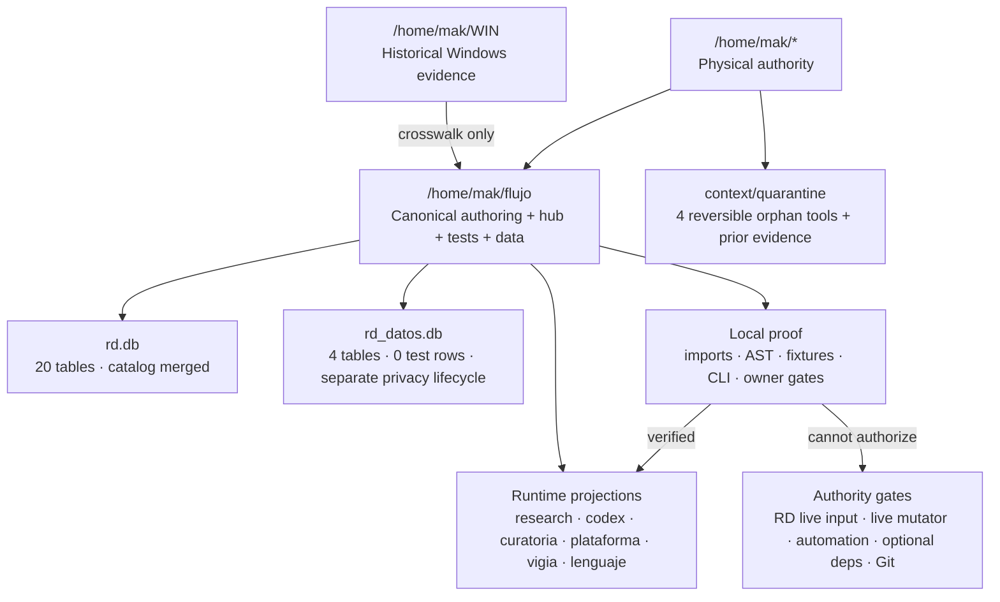

# Phase 307 — visual objective closeout

Date: 2026-08-15 America/Santiago  
Owner: LUNA principal  
Status: `LOCAL_ARCHITECTURE_CLOSED_EXTERNAL_GATES_EXPLICIT`

## House map

## Current disposition

| Surface | Disposition |
|---|---|
| FLUJO canonical source | active owner |
| 25 exact + 21 shim platform pairs | retained by named consumer |
| `memoria.py`, `vigia.py` old platform copies | reversible quarantine |
| `agente_real.py`, `panel_directivo.py` optional/orphan copies | reversible quarantine |
| `WIN` | read-only historical archive |
| `rd.db` | canonical catalog; backup retained |
| `rd_datos.db` | separate privacy store; not merged |
| cron and MAK units | paused/inactive |
| Git branches | proposal only; no Git mutation |

## Remaining gates

1. Authorize and review real RD field input/privacy/date fields.
2. Name one live RD mutation, output and rollback, then execute it foreground.
3. Explicitly re-enable automation only if desired; current `EVENTO ...` bridge is user-confirmed and cron remains paused.
4. Promote optional/provider dependencies only with a named consumer and runtime authority.
5. Create the proposed Git branch system only after explicit Git authorization.

This file is a continuity visualization, not a completion claim. It records
the boundary between locally proven integration and externally consequential
work.
