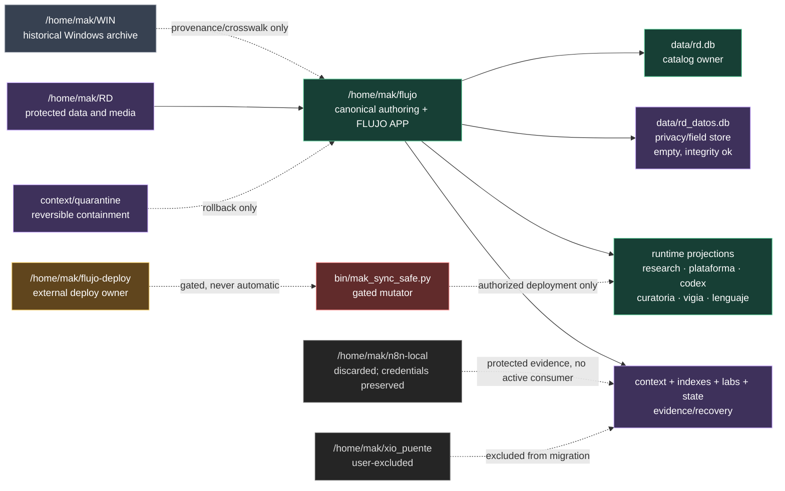

# Phase 386 — visual architecture and owner closeout

Date: 2026-08-15 (America/Santiago)

## Owner map

## Operating rules

| Class | Allowed action | Forbidden shortcut |
|---|---|---|
| Active owner/projection | Compile, import, focused consumer test; edit smallest target | Copy whole trees or create parallel owner |
| Protected data/evidence | Read metadata/counts and preserve provenance | Delete, ingest, rewrite or normalize by filename |
| Historical WIN | Crosswalk and provenance comparison | Treat archive presence as active integration |
| External/deploy | Static audit and contract documentation | Git fetch/reset, SSH, provider or deploy execution |
| Gated/mutating | Fixture and rollback design | Live write without named authority |
| Excluded | Preserve and omit from plan | Use as an excuse to block unrelated local work |

## Closeout interpretation

- The active house is owner-based: `flujo` is canonical and department roots
  are projections only when a consumer exists.
- Similar tools fuse by consumer contract and parity, not by names, language
  or timestamps. Intentional wrappers remain thin projections.
- `rd.db` and `rd_datos.db` are logically related but physically separate;
  the field store remains empty until the review packet is approved.
- Cleanup means reversible quarantine for confirmed residue. WIN, databases,
  credentials, media, generated products and evidence remain protected.

Evidence: Phases 362, 370, 381, 382, 383, 384 and 385.

Disposition: `VISUAL_OWNER_ARCHITECTURE_CLOSED; GATES_REMAIN_EXPLICIT`.
