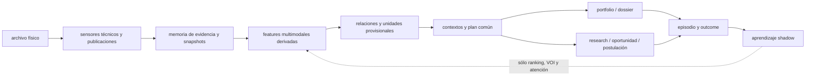

# MAK: plan de acción de la sesión maestra (2026-08-27)

**Estado: evidencia fechada de una sesión. No está en el orden de lectura.**

Hasta el 2026-08-28 este archivo se titulaba «plan maestro único de acción». No
lo era: el orden que carga `tools/agent_bootstrap.py` es `agents.md` →
`docs/MAK_CURRENT_STATE.md` → `context/LAST_HANDOFF.md`, y este archivo no
aparece ahí. Su propia sección siguiente ya lo admitía — un solo commit lo
versionó — pero el título decía lo contrario, y el título es lo que un agente
lee primero. Ver `docs/AUTORIDAD.md`.

## Frontera de procedencia de este documento

Este archivo es el único artefacto que versionó el commit `d592480`; ese
commit creó el plan, no una actualización completa del conjunto de maestros ni
un paquete reproducible del piloto. Por lo tanto, las rutas de código,
manifests, resultados y los otros tres maestros citados aquí son evidencia del
checkout de trabajo cuando están presentes, no contenido garantizado de un
checkout limpio ni de `origin/main`.

Una afirmación marcada como estado local, replay local o resultado local no
puede presentarse como integración distribuida hasta que su artefacto,
validator y hash estén versionados o estén disponibles mediante un paquete
durable explícitamente referenciado. Este plan conserva la dirección del
sistema; no sustituye esos artefactos de evidencia.

## Resultado buscado

MAK v1 recibe cualquier archivo artístico autorizado y produce, sin depender
de revisión humana como gate normal:

1. memoria física y temporal reproducible;
2. reconstrucciones prudentes de proyectos, obras y relaciones;
3. conocimiento cultural y curatorial con procedencia e incertidumbre;
4. un plan común para portfolio, dossier, postulación y research;
5. productos internos útiles, aunque algunos productos externos estén
   correctamente bloqueados;
6. preguntas de alto valor de información cuando falta evidencia;
7. aprendizaje shadow desde outcomes externos independientes;
8. una acción siguiente finita, explicable, segura y eventualmente ejecutable.

Este es el único plan activo. En el checkout reconciliado, `inventory.json`
define qué existe y en qué estado; `hashmap.json` define las dependencias
causales; este documento define el orden de ejecución. Los seis planes fuente
son perspectivas históricas, no backlogs paralelos. La frontera de procedencia
anterior deja claro que esos maestros no fueron incluidos automáticamente en
el commit de este archivo.

## Fotografía operativa — 2026-08-27

MAK no es un clasificador de archivos ni un generador automático de
portafolios a partir de nombres. Es un sistema que conserva el archivo,
construye evidencia y deriva varias salidas sobre la misma memoria:



### Estado actual — separar repositorio versionado de checkout de trabajo

- **Núcleo operativo local:** observer, Archive Memory, Stage 2A–2D, Project
  IR, practice state, relaciones tipadas, snapshots, provenance, replay y
  abstención están presentes en el checkout de trabajo y tienen gates locales
  registrados. Este documento por sí solo no demuestra que toda esa cadena
  esté contenida en `origin/main`.
- **Corte activo:** catálogo explícito + practice states -> relaciones
  cross-archive -> `mak-project-context-v1` -> research frontier. DREF,
  HARRY, BAH y Escarlata son casos de prueba de ese enlace, no entidades
  arquitectónicas.
- **Productos locales:** el plan común y las vistas internas pueden compilarse
  con evidencia; `fit=abstain`, `application=blocked` o
  `source_binding=unknown` son resultados válidos y no detienen la
  reconstrucción del resto del archivo. El output actual no debe llamarse
  portafolio curado: la vista enriquecida registra 11.534 assets internos y
  cero assets con elegibilidad pública explícita.
- **Percepción:** ffprobe/ffmpeg, Pillow, Tesseract y pdftotext son sensores
  locales disponibles. DINOv2, Whisper.cpp y Multilingual-E5 son candidatos
  condicionados para un subcorte futuro de Piso 7; sus pesos no son runtime
  activo ni una dependencia comprometida por este plan.
- **Aprendizaje:** no hay promoción de políticas ni entrenamiento para verdad,
  autoría, identidad o valor artístico. La cabeza futura sólo podrá aprender
  ranking, atención, VOI y selección de consultas desde episodios/outcomes
  aislados por persona/archivo/proyecto.
- **Abierto:** witness nativo/exportación/publicación para fortalecer bindings
  visuales; holdout independiente con binding explícito; receipt causal de
  una sola causa; y la integración controlada de features multimodales.
- **Fuera de alcance permanente:** mutar media o archivos artísticos, borrar
  WIN, publicar, postular, despachar jobs, crear otra base/Hub/lane o usar un
  filename, embedding o coincidencia como verdad cultural.

Esta fotografía reemplaza cualquier lectura que trate ARICA, MYRA, RAYU,
ISKVW, DREF, HARRY, Fondart o DREFQUILA como producto final. Son evidencia y
holdouts para comprobar que la misma cadena puede circular por distintos
archivos.

## Regla de dirección

Sólo hay un corte causal activo. Un corte contiene:

```text
source -> contract -> transformation -> independent gate -> consumer -> receipt
```

El director arregla únicamente el primer bloqueo que impide llegar al consumer.
Al cerrar el corte mide el delta, conserva el receipt y elige la siguiente
dependencia. No abre una auditoría general, un framework, una base, un router,
un modelo o una fase nueva porque aparezca un bug adyacente.

El usuario puede supervisar o cambiar prioridades, pero años de archivo y obra
terminada constituyen el input; una revisión manual no es requisito para que el
sistema observe, investigue, recompute o compile productos internos.

## Corte activo — relación cruzada con roles explícitos — 2026-08-27

Este es el único corte causal activo después de los replays ARICA/DREF/HARRY.
Su objetivo no es crear otra ontología ni convertir una colaboración en
autoría: hacer que una relación externa útil llegue al consumidor de contexto
con sus roles, límites y huecos de evidencia explícitos. La cadena es:

```text
catalogue + practice states -> cross_archive_relations -> mak-project-context-v1
-> existing context consumer -> bounded research frontier
```

La implementación reutiliza
`src/flujo/knowledge/cross_archive_relations.py:project_cross_archive_context`.
El payload físico de relaciones no cambia. La proyección existente ahora
añade `role_bindings` y evidencia en cada relación: un endpoint puede ser una
`candidate_visual_manifestation`, el archivo puede ser
`archive_observed` o `reconstructed_reference`, y la autoría queda
`not_inferred` con la sonda
`native_authoring_project_or_explicit_visual_credit`. La participación del
catálogo se declara `matched_archive_artists_only` y `exhaustive=false`, porque
la existencia de otros colaboradores no se debe borrar ni inventar.

El gate real Escarlata pasó: 6 candidatos cruzados, 11 relaciones de contexto,
5 bindings de manifestación (3 DREF reconstruidos y 2 HARRY físicos), todos en
estado `candidate`; el consumidor `project_context` sigue validando y no crea
proyectos. `physical_merge=false`, `truth_promotion=false`, y el smoke
read-only produjo cero errores. La evidencia local
`ESCARLATA.mp4`/`ESCARLATA_1.mov` demuestra que los archivos son relacionables
con la colaboración, no que el artista del archivo haya creado esas visuales.

El corte anterior de memberships operacionales queda como infraestructura
reutilizable ya validada en
`src/flujo/knowledge/operational_memberships.py` y
`tools/inspect_operational_memberships.py`; no se reabre ni se convierte en
una segunda autoridad. No se adopta Snorkel, Parquet, promoción de reglas ni
otra base dentro de este corte de relaciones, ni se activa aquí un extractor
multimodal. Esa representación queda reservada al subcorte explícito de Piso
7, donde sólo podrá entrar como feature derivada con consumer, provenance y
gate propios.

El siguiente paso es un witness explícito de autoría visual o de exportación
(`.blend`/`.aep` -> render -> publicación) cuando exista; si no existe, MAK
debe conservar la manifestación como candidata útil para curaduría/research,
sin bloquear el resto del archivo y sin inferir autoría desde la ausencia del
proyecto nativo.

## Estado local verificado del corte actual — 2026-08-26

Lo que sigue está respaldado por outputs locales del checkout y no por el
commit `d592480` de forma autosuficiente. La discrepancia de procedencia entre
el piloto histórico y el replay durable queda abierta y no se resuelve
reinterpretando conteos.

El primer corte causal local ya fue ejecutado y no debe reabrirse como auditoría
general. El gate focalizado de episodios pasó con exit 0 según su registro
local. Desde el mismo
`experiments/pilots/ARICA-FONDART-2027/input/archive_observation.json` se
regeneraron `full-baseline` y `enriched`; ambos preservan 12.332 artefactos,
128 observaciones, 512 candidatos y 174 unidades. El enriquecimiento añade
cuatro claims de práctica apoyados, pasa la captura de vigencia a
`current_verified`, produce un programa candidato y reduce los jobs de research
de 17 a 16; el fit permanece `abstain` y la postulación `blocked_with_reasons`.

La comparación durable local registra 14 salidas downstream cambiadas, 9 salidas
comunes idénticas y `unexplained_output_deltas=0`. Los manifests fueron
reabiertos desde disco: los hashes de salida de `mak-pilot-run-manifest-v1` son
hashes semánticos del JSON normalizado, no hashes de los bytes de formato
pretty-printed; esa distinción queda explícita y no se presenta como una
verificación byte-a-byte inexistente.

La procedencia de conteos sigue siendo una discrepancia abierta: el replay
durable local registra 12.332 artefactos, 128 observaciones, 512 candidatos y
174 unidades, mientras el reporte histórico registraba 417 artefactos, 11.916
observaciones y 413 candidatos. El `run_comparison.json` local conserva ambos
conjuntos como snapshots distintos y los marca como `unresolved_provenance_difference`;
este plan no los fusiona ni declara que el histórico haya sido reproducido.

El mismo corte local se repitió sobre HARRY con una captura de vigencia oficial ya
existente. El delta `mak-opportunity-delta-v1` registró dos cambios reales
(`source.validity` y `unknowns`): la oportunidad pasó a `current_verified`, los
jobs bajaron de 17 a 16, pero la práctica, el snapshot y sus claims quedaron
idénticos; `fit=abstain`, dossier `draft_only` y application bloqueada se
mantuvieron. Esto prueba aislamiento entre mundo externo y evidencia de
práctica, no readiness.

La inspección completa del conjunto de candidatos descartó una falsa deriva de
contrato: `programs.json` contiene un candidato condicionado por oportunidad y
otro nativo de práctica; los productos seleccionan el candidato nativo que sí
está presente en ese conjunto.

La relación que faltaba entre los archivos no se resolvió con un merge ciego.
El compilador `cross_archive_relations.py` consumió el catálogo local de
discografía, la federación DREF existente y el estado de práctica HARRY, y
materializó seis candidatos para `Escarlata (Remix)`: tres referencias
reconstruidas de DREFGIRA por dos artefactos físicos de HARRY. El resultado
durable está en
`experiments/pilots/DREFQUILA/runs/cross-archive-escarlata-20260826/relations.json`.
Cada relación conserva endpoints, evidencia del catálogo, estado `candidate`,
alternativa de título coincidente y sonda pendiente; `physical_merge=0` y
`truth_promotions=0`. Esto cierra una relación específica de colaboración, no
la identidad completa de HARRY CHILLAN ni la entrega exacta del clip.

La proyección fue persistida y leída en una base temporal mediante el
consumidor existente: el contrato de escritura conserva `mak-project-context-v1`
y la consulta devuelve `mak-project-context-read-v1` con el grafo bajo
`contexts[]`; regresaron las seis relaciones de pares y cinco anclajes de
manifestación, todos candidatos, sin proyectos. La diferencia de envoltura es
parte del contrato del consumidor y queda cubierta por el gate.

El enlace siguiente quedó ejecutable mediante
`cross_archive_research_frontier.py`: las seis relaciones Escarlata se agrupan
en un job de `curatoria` con el requisito técnico
`relation-binding:<work_id>`, preservan la sonda de entrega/publicación y
entregan `unresolved` al triangulador existente cuando no hay resultados. El
job es compatible con la forma de `create_job`, pero `create_job` no fue
invocado; el namespace de oportunidad es sólo técnico.

La frontera se ejecutó después con una captura acotada real de dos grupos
independientes: Apple Music y YouTube. El resultado durable está en
`experiments/pilots/DREFQUILA/runs/cross-archive-escarlata-20260826/research-result.json`
y la triangulación válida en
`experiments/pilots/DREFQUILA/runs/cross-archive-escarlata-20260826/research-triangulation.json`.
Devuelve un `supported_candidate` cuyo statement está limitado al registro
público de colaboración de Escarlata; no prueba que un archivo local concreto
sea la entrega, ni que todo HARRY CHILLAN pertenezca a esa obra. No hubo
dispatch, promoción ni escritura en la base de producción.

Una segunda sonda sobre una URL pública identificada como publicación oficial
de ELEVEN1.1 quedó registrada en el mismo `SourceCorpusStore`. La URL canónica
se capturó dos veces con bytes crudos distintos y texto normalizado equivalente;
el store conserva ambas versiones. Sólo los receipts seleccionados de Apple
Music y del primer YouTube permanecen en la triangulación durable. Esto fija una
regla para el loop general: una nueva captura raw es una versión de fuente, no
una nueva relación artística, y no entra al resultado hasta estar enlazada por
su claim.

El límite es importante: los tres endpoints DREF provienen del estado
`reconstructed_reference_only` con `archive_id/snapshot_id` desconocidos,
mientras HARRY proviene de un snapshot físico. Por eso la arista es
relacionable y útil para curaduría/research, pero no se promueve a hecho de
entrega o de pertenencia total sin un witness adicional.

La sonda read-only de cobertura sobre cuatro contextos —DREF físico completo,
DREFGIRA reconstruido, BAHPARTY adyacente y HARRY— produjo 20 candidatos sobre
614 refs y cuatro tracks: 12 entre DREFGIRA reconstruido y DREF físico, 6 entre
DREFGIRA y HARRY y 2 entre BAHPARTY y DREFGIRA. El DREF físico no tiene una ref
física de Escarlata. La conclusión operativa es que la relación Escarlata es
válida como puente candidato a través de DREFGIRA, mientras el archivo físico
completo aporta otras relaciones; no se debe colapsar ambos contextos del mismo
artista ni inventar un `archive_id` común.

Como holdout de portabilidad, el mismo core atravesó el archivo DREF físico
completo: 44 artefactos físicos, 40 relaciones de topología, una unidad
`exported_product` provisional, 40 asignados y 4 no asignados, sin claims
apoyados ni mutación de fuente. Esto demuestra un segundo archivo del mismo
artista, no todavía otro artista. DREFGIRA y BAHPARTY quedan como material
adyacente no fusionado porque no tienen binding explícito de persona/archivo
independiente.

## Piso 0 — Restaurar la causalidad actual

### Objetivo

Cerrar la única arista rota del replay ARICA/Fondart y volver a un estado donde
baseline y enriched puedan materializarse por la misma cadena.

### Estado de entrada verificado

- `experiments/pilots/ARICA-FONDART-2027/input/archive_observation.json` existe
  con 12.332 artefactos y snapshot estable.
- `opportunity_validity_capture.json` existe, es válido y declara
  `current_verified`, `confirmed=true`, `effective_to=2026-09-10`.
- `practice_receipt_evidence.json` existe con cuatro bindings físicos exactos.
- El gate focalizado actual pasa: el diagnóstico de 10 fallos pertenece a un
  estado anterior del checkout y no es evidencia del estado presente.
- La corrección vigente deriva `program_requirement_ids` y
  `research_requirement_ids` dentro de `_validate_plan`, donde existen el plan
  y el índice de programas.

### Acción mínima ya ejecutada

1. Se eliminó el cálculo de requirement IDs de `_input_hashes`.
2. Se insertó dentro de `_validate_plan`, después de validar `program_by_id` y
   antes de construir el contexto retornado.
3. Se mantienen dos conjuntos:
   `program_requirement_ids` para referencias propias de programas y
   `research_requirement_ids` para jobs; usar su unión sólo donde el contrato
   permita ambos namespaces.
4. El gate se ejecutó sin modificar schemas, bases, fixtures de readiness ni
   otras capas.

### Gate

```text
PYTHONPATH=. ./.venv/bin/python -m pytest -q \
  tests/test_product_episode.py \
  tests/test_product_learning.py \
  tests/test_product_plan.py \
  tests/test_application_research_package.py \
  tests/test_autonomy_plan.py
```

### Salida verificada

- tests focalizados exit 0;
- ninguna regresión de `publication=false`, `submission=false`,
  `dispatch=false`, `promotion=none` o `training_permitted=false`;
- el mismo fixture sigue rechazando requirement refs extranjeros;
- no se abrió ningún bug no causal.

### Stop histórico

El stop ya no aplica a este corte. Si un siguiente cambio exige cambiar un
schema aceptado, detener y demostrar primero el conflicto con un caso mínimo.
No adaptar el contrato al manifest enriquecido.

## Piso 1 — Replay causal ARICA/Fondart (cerrado; producto interno)

### Objetivo cumplido

Producir dos runs comparables desde el mismo snapshot: baseline sin los dos
enrichments y enriched con captura de vigencia más receipts de práctica.

### Trabajo ejecutado

1. Materializar `full-baseline/` desde `archive_observation.json` y
   `opportunity_document_package.json`, con `source_rescan=false`.
2. Materializar `enriched/` desde esos mismos inputs más
   `practice_receipt_evidence.json` y `opportunity_validity_capture.json`.
3. Añadir o terminar un verificador de materialización que reabra cada JSON,
   recalcule `sha256_json` y compare con `manifest.json`.
4. Rechazar manifests anteriores como baseline final si fueron creados antes
   de las correcciones de frontier o episode.
5. Ejecutar la regresión focalizada de los contratos atravesados.

### Comandos base

```text
PYTHONPATH=. ./.venv/bin/python tools/materialize_pilot_run.py \
  --observation experiments/pilots/ARICA-FONDART-2027/input/archive_observation.json \
  --opportunity-package experiments/pilots/ARICA-FONDART-2027/input/opportunity_document_package.json \
  --output-root experiments/pilots/ARICA-FONDART-2027/runs/full-baseline

PYTHONPATH=. ./.venv/bin/python tools/materialize_pilot_run.py \
  --observation experiments/pilots/ARICA-FONDART-2027/input/archive_observation.json \
  --opportunity-package experiments/pilots/ARICA-FONDART-2027/input/opportunity_document_package.json \
  --practice-receipt-evidence experiments/pilots/ARICA-FONDART-2027/input/practice_receipt_evidence.json \
  --opportunity-validity-capture experiments/pilots/ARICA-FONDART-2027/input/opportunity_validity_capture.json \
  --output-root experiments/pilots/ARICA-FONDART-2027/runs/enriched
```

### Matriz causal obligatoria

Comparar, por ID y no sólo por conteo:

| Plano | Baseline | Enriched | Explicación exigida |
|---|---:|---:|---|
| source gate | estado y razones | estado y razones | exact capture refs |
| practice claims | supported/candidate/unknown | delta | exact receipt refs |
| assets/resources/media | inventario | delta | exact artifact refs |
| requirements | supported/unknown/contradicted | delta | explicit bindings |
| fit | decisión y razones | delta | requirement-level proof |
| programs | accepted/abstained/rejected | delta | evaluator result |
| frontier | job IDs and VOI | delta | closed or preserved gaps |
| dossier | atoms/assets/gaps/status | delta | common plan lineage |
| application | gate/status/missing docs | delta | no forced readiness |
| autonomy | actions and stop | delta | frontier/product state |

### Gates verificados

- manifests y outputs verifican desde disco;
- mismos input hashes en ambos runs salvo los dos enrichments declarados;
- `unexplained_output_deltas=0`;
- menos gaps sólo cuando existe nueva evidencia;
- un requisito no apoyado sigue unknown;
- `rejected` permanece rejected;
- fuentes ARICA no cambian;
- cero publication, submission, dispatch, promotion, training o DB productiva.

### Salida

Un `run_comparison.json` reproducible y un `RESULTS.md` humano bajo el root del
piloto, con hashes, comandos, exit codes, deltas y límites. Sólo entonces se
puede llamar aceptado al replay enriquecido.

## Piso 2 — Entregar primero el producto interno y después el portafolio curado

### Objetivo

Convertir el run aceptado en un conjunto durable de productos internos de MAK y
usar ese fundamento para producir después un portafolio curado, sin llamar
portafolio a un inventario técnico ni crear un portafolio manual paralelo.

### Producto coordinado

- **Vista/dossier interno de evidencia:** secuencia, claims apoyados, assets
  internos, provenance, alternativas y gaps.
- **Portafolio curado:** selección representativa de obras, series o procesos
  solo cuando exista una función curatorial explícita y una trazabilidad de
  cada inclusión. El output actual todavía no alcanza este estado.
- **Postulación Fondart:** requirements completos, hard gates, documentos y
  estado bloqueado o draftable según evidencia real.
- **Research brief:** preguntas que aún pueden cambiar el producto, con VOI,
  source policy y condiciones de parada.

### Trabajo

1. Seleccionar desde el common product plan únicamente narrative atoms con
   claims supported y assets permitidos.
2. Producir una vista humana legible y una vista JSON auditada desde los mismos
   IDs; no escribir narrativa sin refs.
3. Resolver privacidad, licencia y publicabilidad por asset.
4. Mantener el producto privado si no existe un witness de manifestación
   pública o licencia suficiente.
5. Registrar qué gap impide pasar de internal/draft a public/submit.

### Criterio de utilidad

Una persona puede entender la práctica, ver evidencia representativa y saber
qué falta para una oportunidad sin leer el filesystem ni los reports técnicos.
La vista actual no se declara terminada mientras solo exponga un inventario
interno; el producto sigue siendo válido si la postulación queda bloqueada.

### Gate

- todo texto y asset retrocede a evidence refs;
- cero claims inventados;
- dossier, application y research comparten `product_plan` hash;
- public/private/license son explícitos;
- rebuild determinista;
- ninguna acción externa ocurre.

## Piso 3 — Demostrar portabilidad, no sólo parametrización

### Objetivo

Probar que el core aprende y compila sin reglas ARICA.

### Estado verificable de portabilidad — 2026-08-26

Se materializó un candidato de otra persona a partir del archivo físico
`/home/mak/curatoria_inbox/HARRY CHILLAN`, usando el profile explícito y el
observer existente. El replay desde
`experiments/pilots/HARRY-NACH-2026/input/archive_observation.json` atravesó sin
rescan el mismo core: 20 artefactos, 2 observaciones, 2 relaciones, una unidad
`exported_product` provisional, 20 asignaciones y un Project IR. El replay en
memoria fue determinista y mantuvo `source_mutation=false`, sin DB, red,
publicación, postulación ni entrenamiento.

El caso no se declara plenamente aceptado: el catálogo local respalda la
identidad de Harry Nach, pero marca la relación específica HARRY CHILLAN como
`contextual_candidate`; por tanto el sistema no afirma que todos sus archivos
sean una obra o show único. La salida conservadora fue `fit=abstain`, dossier
`draft_only`, postulación `blocked_with_reasons` y tres claims `unknown`.

La triangulación read-only del grafo existente encontró 617 enlaces para las
20 rutas físicas, distribuidos entre tokens `harry`, `mov`, `chillan` y `snow`.
Como todos son señales `path_token_context_only`, se conservaron como contexto
para futuras sondas y no como evidencia de autoría, obra o show.

Este resultado cierra el gate de portabilidad a nivel de persona/archivo
observado: el mismo core atravesó un archivo declarado de Harry Nach sin reglas
específicas de caso. No cierra la pertenencia exhaustiva de la subcarpeta a una
obra o show, que es una relación distinta y permanece contextual. El siguiente
gate puede fortalecer ese binding o materializar otro archivo/persona con una
relación explícita; ninguna de las dos cosas debe bloquear el uso del core ni
autorizar reglas basadas en el nombre HARRY.

La reconciliación durable quedó en
`experiments/pilots/HARRY-NACH-2026/runs/fondart-holdout-20260826/portability-comparison.json`.
Compara ARICA como referencia de cadena completa, DREF como archivo del mismo
artista y Harry como candidato independiente, manteniendo separados los
espacios físicos y los estados de evidencia. La comparación no convierte el
candidato en aceptación: sólo demuestra que el core puede atravesar una
estructura distinta y abstenerse correctamente.

El enriquecimiento de oportunidad de HARRY queda en
`experiments/pilots/HARRY-NACH-2026/runs/fondart-enriched-opportunity-20260826/`
y su delta está enlazado desde `portability-comparison.json`. La captura
compartida no se convirtió en evidencia de HARRY: sólo cambió restricciones y
sondas del mundo externo. El binding de subarchivo sigue contextual y es el
límite de portabilidad, aunque el replay físico ya sea reproducible.

### Secuencia de holdout

1. **Archivo independiente del mismo artista:** elegir un root no usado para
   ajustar el slice, ejecutar observer -> product y medir cobertura y fallos.
2. **Archivo de otra persona o artista:** HARRY ya cubre el primer replay de
   persona; el próximo perfil debe tener binding explícito si se quiere cerrar
   el gate de identidad de subarchivo, sin cambiar el core. Sólo adapters
   declarados por formato pueden variar.
3. **Snapshot temporal:** repetir sobre un estado posterior para probar moves,
   cambios, ausencias y continuidad.

### `archive_profile`

Debe declarar tenant, archive ID, roots, formatos observables, adapters
permitidos, política de privacidad/licencia y consumidores esperados. No puede
contener nombres de obras como lógica.

### Métricas

- `source_mutations=0`;
- `false_identity_merges=0`;
- `lost_artifact_refs=0`;
- `partition_violations=0`;
- `case_name_rules=0`;
- replay determinista bajo otra raíz;
- false-supported claims sobre un gold set ciego pequeño;
- producto interno útil por archivo;
- gaps y abstenciones comparables, no forzadamente menores.

### Stop

Dos archivos de ARICA o dos fixtures no prueban portabilidad. Si un adapter
específico domina el resultado, clasificarlo como capacidad de formato, no como
aprendizaje general.

## Piso 4 — Construir el radar cultural y de oportunidades

### Objetivo

Hacer que scraping e investigación actualicen el marco teórico y los requisitos
de portfolio, propuesta y postulación sin crear un crawler o store paralelo.

### Estado verificable del enlace

La captura versionada y las constraints ya tienen un diff semántico reusable en
`src/flujo/knowledge/opportunity_delta.py`, con CLI
`tools/compile_opportunity_delta.py`. Sobre el replay real ARICA baseline ->
enriched produjo `mak-opportunity-delta-v1` con dos cambios: `source.validity`
y la lista de `unknowns`, preservando `p28-deadline-local`. Marcó nueve
consumidores existentes para recomputación selectiva y los nueve outputs
correspondientes realmente cambiaron en el mismo replay. La prueba no crea una
base ni ejecuta esos consumidores. El enlace Vigía -> plan de captura ya está
cerrado en `src/flujo/knowledge/vigia_capture_bridge.py`: el smoke con el
`revisar_fuente` real produjo una oportunidad y `capture_one` devolvió un plan
validado sin red, DB ni dispatch. El puente ahora también expone una operación
explícita `capture_vigia_plans` y el CLI `--record`, que llama al mismo
`capture_one(record=True)` y produce `mak-vigia-capture-receipts-v1` con hash
del plan, IDs de captura y límite de intentos. La forma de evidence-return ya es consumida
por el replay/product plan y fue validada con el receipt real de Escarlata en
su frontera propia; para una oportunidad Vigía general aún falta hacer durable
el receipt de captura y conectarlo a la recomputación selectiva, sin ejecutar
consumidores no afectados.

La forma de esa frontera también fue probada sin red en un temporal:
`capture_one(record=true)` -> `adapt_execute_research_report` ->
`triangulate_research_evidence` -> `build_evidence_return` devolvió 16 pares
`unresolved`, conservó los gaps y produjo cero promociones. No se considera
captura real ni escritura durable; confirma que no hace falta otro adaptador
para esa forma, sólo un receipt real y una ingesta autorizada.

El enlace adicional ya ejecutado reutiliza el consumidor existente:
`tools/capture_opportunity_validity.py` acepta el receipt Vigía, abre el
`SourceCorpusStore` seleccionado en lectura, hidrata `capture_id` a hashes,
texto, estado HTTP y `retrieved_at`, y entrega esas filas a
`build_opportunity_validity_capture`. La prueba temporal de tres URLs alcanzó
`current_verified` sin una segunda llamada de red; un receipt fallido queda
como entrada incompleta y no produce vigencia. El alcance es deliberadamente
estrecho: sólo URLs oficiales declaradas por ese consumidor pueden mapearse a
roles. El enlace genérico hacia memoria de oportunidad y el receipt causal de
recomputación selectiva siguen abiertos.

El primer receipt causal ya está implementado como proyección read-only en
`src/flujo/knowledge/selective_recompute_receipt.py` y su CLI. Lee el delta y
los hashes de manifests ya materializados, normaliza nombres de outputs a los
consumidores declarados y devuelve `causally_bounded`, `incomplete_output_coverage`
o `mixed_or_unexplained`. Contra los manifests reales de ARICA observó 17
outputs cambiados: 9 correspondían al delta de oportunidad y 7 quedaron
explícitamente inexplicados porque el mismo replay también agregó evidencia de
práctica. Ese resultado es un gate útil: no permite usar ese replay combinado
como etiqueta causal ni de aprendizaje.

### Trabajo

1. Crosswalk de Vigía candidate -> bounded capture plan (cerrado; sólo plan).
2. Memoria versionada de oportunidad con diff semántico por requirement
   (cerrado para dos versiones de constraints).
3. Priorización por impacto: vigencia, deadline, elegibilidad, presupuesto,
   documentos, criterios y pesos.
4. Triangulación sólo para claims ambiguos o contradichos.
5. Ingestar el receipt de captura/evidence-return y conectar la recomputación
   selectiva de productos afectados por el diff, sin recomputar consumidores no
   afectados.
6. Portfolio de oportunidades multi-caso: qué evidencia sirve para cuáles
   oportunidades y qué research tiene mayor reutilización.

### Gates

- una URL por intento, timeout y budget;
- URL igual/hash distinto crea versión;
- URLs distintas/bytes iguales no crean independencia;
- candidato sin locator queda review;
- cambio HTML no semántico no recomputa;
- no daemon, base ni router nuevo;
- costo y latencia por hard gate cerrado son medibles.

## Piso 5 — Reconciliar capacidades y departamentos

### Objetivo

Convertir herramientas existentes en rutas ejecutables sin una nueva
burocracia.

### Crosswalk único

Para cada capacidad relevante:

```text
capability_id -> physical owner -> input schema -> output schema
-> validator -> real consumer -> runtime proof -> disposition
```

Estados permitidos:

- `available_tool`;
- `integrated_capability`;
- `operational_knowledge`;
- `verified_product_path`;
- `historical_or_unwired`;
- `unavailable_with_reason`.

### Prioridad

Mapear primero sólo lo consumido por los Pisos 0–4: observer, research capture,
triangulation, product compiler, Copilot, `triangular.py`, Hub y futuro
Conductor. RD e ISKVW conservan su autoridad y pueden aportar patrones; no se
fusionan sus bases o semánticas con Curatoria.

### Gate

Cada entrada tiene path, owner, consumer y prueba foreground. Una fila de
`CAPACIDADES.md`, una key configurada o un módulo importable no bastan.

## Piso 6 — Curaduría comparativa y productos multiarchivo

### Objetivo

Pasar de reconstruir un archivo a formular programas culturales comparativos.

### Trabajo

1. Generar hipótesis técnicas, históricas, conceptuales y de manifestación por
   separado.
2. Conservar evidence for/against, alternativas y próxima sonda.
3. Evaluar secuencias por cobertura, diversidad, coherencia, contradicción,
   costo y oportunidad.
4. Compilar variantes monográfica, transversal, cronológica y opportunity-led
   desde el mismo evidence graph.
5. Exigir witness independiente para publicación y manifestación pública.

### Gate

La comparación no puede convertir similitud en serie ni usar una postulación
como definición retroactiva de la práctica.

## Piso 7 — Aprendizaje shadow

### Objetivo

Usar la supervisión natural y outcomes externos para mejorar atención,
representación, ranking, VOI y query selection.

### Subcorte de representación multimodal — 2026-08-27

Este subcorte no crea un piso, una base, un corpus ni una autoridad nuevos.
Completa el Piso 7 con una capa de extracción de features sobre la observación
ya existente. La secuencia obligatoria es:

```text
sensores actuales -> features reproducibles -> representación congelada
-> cabeza MAK pequeña -> ranking/VOI/query selection en shadow
```

La siguiente combinación es una lista de candidatos condicionados, no una
decisión de implementación ni una dependencia del núcleo:

- `ffprobe`/`ffmpeg`, Pillow, Tesseract y `pdftotext` permanecen como sensores
  primarios de hechos técnicos, texto visible, estructura temporal y formato;
- DINOv2 ViT-S/14 es el primer extractor visual para imágenes, renders y
  frames;
- Whisper.cpp `tiny`/`base` es el primer extractor de transcripción para
  audio y video;
- Multilingual-E5-small es el primer extractor textual para captions, OCR,
  documentos y metadata en español;
- MobileCLIP2 queda como segundo extractor visual-textual sólo si el consumidor
  demuestra que DINOv2 y E5 no conectan una modalidad necesaria;
- MERT/CLAP, Florence-2, SmolDocling y SmolVLM2 son adaptadores opcionales por
  modalidad, no dependencias del núcleo ni autoridades semánticas.

Los features se guardan como observaciones derivadas con `artifact_ref`,
content/model version, método, provenance y hash; nunca sustituyen
`PhysicalArtifact`, `Observation`, `Relation` ni `Project IR`. La cache se
indexa por identidad de contenido, snapshot semántico y versión del modelo,
no por ruta, nombre o mtime. Un cambio de ruta o un `touch` no crea una nueva
señal aprendida.

La supervisión natural inicial proviene de publicaciones y captions ya
existentes, duplicados exactos, versiones, secuencias temporales,
co-consumo, exports y relaciones explícitas. Una similitud visual, un texto
extraído o la proximidad de un nombre sólo generan evidencia o candidato; no
generan autoría, obra, serie, publicación ni valor artístico.

No se agrega una fase independiente de “IA”. Este subcorte queda subordinado
al producto útil y al aprendizaje shadow: si la representación no mejora una
decisión de ranking, atención, VOI o query selection sin aumentar falsos
enlaces, se descarta el extractor y se conserva la instrumentación existente.

### Dependencias

- episodios con decisión anterior al outcome;
- receipts externos validados;
- varios grupos independientes de persona/archivo/proyecto;
- splits congelados antes de features;
- baseline determinista;
- producto y research ya útiles sin ML.
- extractor local reproducible por modalidad, con licencia y versión
  registradas;
- fallback funcional en sensores actuales si un modelo no está disponible.

### Trabajo

1. Emitir features desde los sensores actuales y preservar su provenance antes
   de incorporar pesos neuronales.
2. Incorporar DINOv2, Whisper.cpp y Multilingual-E5 como extractores
   congelados, con cache y replay; no fine-tuning todavía.
3. Construir datasets de relaciones y episodios sin drafts como labels,
   usando sólo señales naturales y separando por archive/person/project.
4. Entrenar únicamente una cabeza pequeña para ranking, atención, VOI o query
   selection; truth, authorship, identity y artistic worth quedan fuera.
5. Evaluar recuperación, ranking, calibración, costo de sonda y utilidad del
   producto sobre holdout; mantener cada policy candidate en shadow.
6. Matar un extractor o cabeza si no supera el baseline determinista, rompe
   replay, depende de red/runtime externo, o aumenta falsos enlaces.

### Gates

- `learning_leakage=0`;
- identity group fuera del feature set;
- open/abstain/unresolved no son negativos;
- truth, authorship, identity y artistic worth nunca son targets autogenerados;
- `training_permitted=false` hasta evidencia suficiente.
- cada feature puede volver a su artefacto, método, versión y hash;
- el núcleo funciona aunque falte cualquier modelo opcional;
- no se descarga ni ejecuta un modelo generativo para producir una afirmación
  cultural;
- la primera promoción posible sólo afecta ranking, atención, VOI o query
  selection y permanece en shadow.

## Piso 8 — Autonomía ejecutora acotada

### Objetivo

Permitir que el sistema ejecute automáticamente sólo acciones reversibles que
ya demostraron valor.

### Allowlist inicial

- observe read-only;
- capture bounded autorizada por policy;
- recompute local determinista;
- compile producto privado;
- validate y registrar receipt.

### Precondiciones

Consumer real, presupuesto, timeout, `max_attempts`, idempotency key,
validación independiente, receipt, rollback, observabilidad y kill switch.
Publish, submit, promote, train y source mutation permanecen prohibidos hasta
una autorización y gate propios.

## Orden inmediato, sin bifurcaciones

1. Mantener como receipt el gate de `product_episode.py` y no reabrirlo sin una
   regresión nueva.
2. Mantener `full-baseline` y `enriched` regenerados desde el mismo observation
   input.
3. Revalidar outputs por hash semántico canónico al cambiar el compilador; no
   confundirlo con hash de bytes formateados.
4. Mantener la matriz causal y sus deltas explicados.
5. Mantener el primer dossier/portfolio interno coordinado con application y
   research brief desde el mismo plan.
6. Consumir la relación Escarlata en la proyección contextual existente,
   manteniendo sus seis candidatos, sus cinco anclajes candidatos al track y
   su abstención de entrega.
7. Mantener como cerrado el retorno de evidencia pública de Escarlata —dos
   grupos independientes y triangulación válida—, pero conservar abierta la
   sonda de binding local exacto. La siguiente acción es buscar un witness
   físico/derivado que conecte la entrega con los endpoints, o registrar la
   abstención si ese witness no existe; no convertir `supported_candidate`
   acotado en hecho de entrega ni en tarea humana obligatoria.
8. Materializar un holdout de otra persona o artista con binding explícito, sin
   usar DREFGIRA/BAHPARTY como sustitutos.
9. Integrar Vigía -> plan -> receipt bounded; este enlace ya está cerrado en
   `capture_vigia_plans` y el CLI opt-in `--record`, sin hacer de la captura una
   inferencia cultural.
10. Conectar el receipt a una memoria/evidence tipada y al compilador documental
    específico de la oportunidad. El tramo Vigía -> receipt -> compilador de
    vigencia oficial ya está cerrado para URLs declaradas; un receipt genérico
    no puede inventar constraints desde una URL ni sustituir la captura oficial.
11. Separar los inputs directos, ejecutar diff -> recomputación selectiva sólo
    para consumidores afectados y registrar un receipt causal sin outputs
    inexplicados. El reconciliador ya detecta el caso mixto; falta producir un
    replay de una sola causa que alcance `causally_bounded`.
12. Activar el subcorte de representación multimodal dentro de Piso 7:
    sensores actuales primero, DINOv2/Whisper.cpp/E5 después, cabeza pequeña
    al final; no abrir una fase de IA separada.
13. Acumular outcomes externos antes de aprendizaje shadow y abrir autonomía
    ejecutora sólo después de probar receipts y rollback.

## Uso de agentes bajo el nuevo director

El director conserva misión y causalidad; los agentes reciben slices bounded.
Cada dispatch debe incluir bootstrap, write-set exacto, input/output contracts,
primer comando de validación y stop condition. Los resultados de agente son
candidatos hasta reconciliarse contra filesystem, tests y consumers.

Perspectivas disponibles como fuentes:

- `docs/session_learning/responder_saludo/`: misión y sistema intelectual;
- `docs/session_learning/luna_observar_archivos_mak/`: archivo y memoria;
- `docs/session_learning/auditar_capacidades_mak/`: capacidades y consumidores;
- `docs/system_learning/luna_archive/`: conservación;
- `docs/system_learning/luna_control/`: control y organización;
- `docs/system_learning/luna_world/`: mundo externo y research.

No deben reactivarse todos a la vez por costumbre. El director decide si un
slice realmente puede avanzar en paralelo sin compartir write-set ni depender
del resultado aún desconocido de otro slice.

## Condición de finalización de MAK v1

MAK v1 existe cuando dos archivos independientes y al menos un archivo de otra
persona pueden atravesar la misma cadena; cada artifact, relación, claim,
requirement y producto conserva provenance e incertidumbre; el sistema produce
un dossier interno útil; bloquea correctamente publicación y postulación;
convierte gaps relevantes en sondas finitas; aprende sólo de outcomes externos
con holdout; y selecciona una siguiente acción explicable sin efectos externos
implícitos.

Hasta entonces, el norte no es “cero bugs”. Es una causalidad cada vez más
completa, portable, útil y honesta.

## Baseline de orden operativo — 2026-08-27

Este registro no abre otro piso: fija cómo se considera limpio el mismo plan.

1. `data/mak_knowledge.db` es la memoria MAK activa y el único destino común
   para las proyecciones MAK que ya tienen contrato; no se crea otra base de
   autoridad.
2. `data/rd.db`, `data/rd_datos.db` y `data/flujo.db` permanecen separados por
   ownership, privacidad y consumidores. Se conectan mediante referencias y
   crosswalks existentes, no mediante copias masivas.
3. Las bases de `research/`, `labs/`, `experiments/pilots/` y
   `out/archaeology/` son capturas, snapshots o evidencia histórica. Cada una
   conserva su hash, fecha y alcance; ninguna se presenta como runtime actual.
4. El inventario físico completo fuera de `WIN` está en
   `inventory.json:physical_organism_registry`; `database_registry` mantiene
   la clasificación de 270 archivos SQLite detectados (85 superficies MAK,
   185 caches host/aplicación). El mapa causal de las conexiones está en
   `hashmap.json`. Si una ruta no aparece ahí, queda como gap de inventario,
   no como autoridad implícita.
5. La frontera física es `/home/mak` menos `/home/mak/WIN`; los montajes
   `GoogleDrive` y `OneDrive` se registran pero no se recorren. `flujo` es el
   baseline de autoría; `plataforma`, Research, Curatoria, RD, Vigía,
   Portfolio, Labs, runner, modelos y puentes tienen owner y estado propio.
6. La validación de orden es reproducible: SQLite `integrity_check`, JSON
   parseable, tests del consumidor, `git diff --check`, estado local limpio y
   `origin/main` sin ramas permanentes adicionales. Ningún paso de este orden
   elimina evidencia, media, artwork, `WIN` o bases.

### Criterio de cierre de esta limpieza

El corte queda cerrado cuando el registro de stores, capacidades, estado,
teoría, plan y handoff contienen la misma autoridad y fecha de medición; los
consumidores declarados existen; los hashes se pueden repetir; y la única
pendiente restante es una integración funcional explícita, no una confusión de
ruta o de autoridad.
