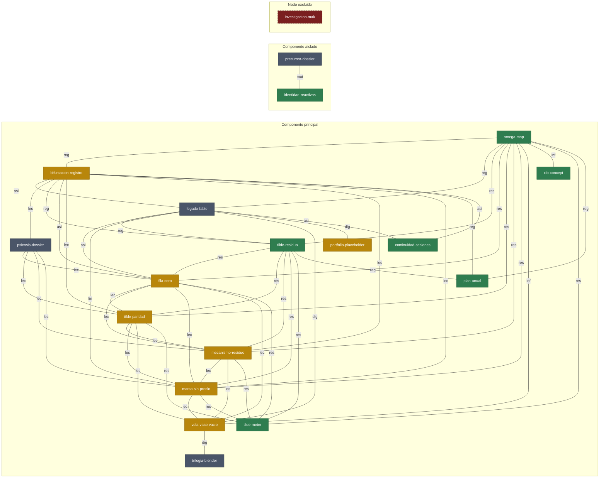

# MAPA GENERATIVO — grafo de digestión de las ideas a medias

## 1. Qué es esta pieza

Esto no es un índice: es un **grafo de digestión**. Cada fragmento a medias del
repo (dossier, script, handoff, HTML sin commitear) entra como un nodo que
**nunca se borra**; cuando dos nodos comparten suficiente sustancia semántica
(dos o más ejes en común), el grafo traza una arista entre ellos. Lo que no
conecta con nadie no se elimina: se marca huérfano y se le prescribe el
**puente mínimo** — el eje o la acción concreta que lo conectaría — sin
tocarlo. Un nodo que nadie retoma no desaparece: pasa a **compost**, fechado,
con sus aristas intactas. Esta es la lógica del basurero/fungi del portfolio
(projects/cultura/README, SKILL.md director-de-arte) aplicada a las ideas en
vez de a los archivos borrados: nada se pierde, todo se digiere a la vista.

Mecanismo antes que resultado: esto es matemática de conjuntos (ejes
compartidos → peso de arista) sobre un catálogo curatorial. El resultado
visual (la tabla, el mermaid) es la excreta; el mecanismo es el sistema.

**Nota de alcance**: el pedido esperaba 12-18 nodos; el relevo encontró 19
(ver nota de cierre) porque además del material explícitamente listado
aparecieron fragmentos frescos sin commitear (la tríada `fila_cero` /
`tilde_paridad` / `mecanismo_residuo` / `marca_sin_precio`, el cluster VOLÁ,
la trilogía Blender) que nadie había catalogado todavía. El corpus crudo
`puente/v1/` y `puente/v2/` (FASE_1-7, OBRA_01/02, 00_ANAMNESIS…05_LENGUA_EMOJI,
MOTOR.md, SPEC.md) y `projects/cultura/dossiers/tapiz.md` y `tilde.md` **no**
se catalogaron como nodos propios: son la fuente primaria detrás de
`omega-map` y `legado-fable`, ya de por sí maduros y citados en otros
documentos vivos. `investigacion-mak` entra solo por nombre de archivo, por
la exclusión dura de esta tarea (ver §4, nodo 19).

## 2. Semilla (paso a del motor Ω)

Pedido real del artista, 15-jul-2026: *"curador generativo: conectar las
ideas a medias vía matemática y semántica, sin borrar nada."* Arranque válido
según `puente/README.md` (un pedido real enciende el motor).

⊕ que esta pieza conecta explícitamente: **⊕₃** (tilde_meter mide dialecto
degradado — origen de todo el clúster Tilde), **⊕₄** (el desacuerdo sobre el
mecanismo es el residuo, no la rama — origen de `mecanismo-residuo`), **⊕₅**
(el costo de significado no cruza a código — origen de `marca-sin-precio` y
del audit `tilde-paridad`). Toca también, sin activarlas, **⊕₁** (asimetría
de acceso, vive en `fila-cero`) y **⊕₂** (bloqueada, ver `legado-fable`).

## 3. Ω11 — declarada antes del mapa

> Esta pieza pierde si un agente barato (Sonnet/Qwen), leyendo SOLO este
> mapa, no puede localizar cada idea a medias del repo y nombrar con qué
> otras conecta y por qué.

Evaluable por cualquiera que corra ese test con otro modelo: dar a un agente
fresco únicamente este archivo y pedirle que ubique, por ejemplo,
`mecanismo_residuo.py` y diga con qué otros tres nodos comparte eje y cuál es
el eje. Si no puede, la pieza decoró la semilla en vez de activarla.

## 4. Catálogo de nodos

Formato por nodo: **id** — ruta real — estado — sistema abstracto (tabla del
director-de-arte) — esencia — qué falta para cruzar.

**1. `omega-map`** — `puente/OMEGA_MAP.md` — *viva* — interfaz biocibernética.
Tabla que traduce el vocabulario teórico de `idea_generativa` (⊕ semilla,
Motor 5 pasos, Precursor, Psicosis, Apofenia, Ω11, Ancla, Cultura, Tilde) a
sus equivalentes operativos en flujo (inbox/datadrops, pipeline, templates,
multiagente, sobre-ingeniería, verify/pytest, checkpoints, clientes reales,
brechas ES/EN/código). Es el diccionario que permite leer cualquier feature
de flujo como una jugada del motor Ω.
*Falta*: nadie verifica con código que la fila "Ω11 ↔ `flujo verify`" siga
siendo cierta cuando el CLI cambie; es prosa curada a mano, no un test.

**2. `bifurcacion-registro`** — `puente/BIFURCACION_REGISTRO.md` —
*bloqueada* — entropía de registro. Instrumento de psicometría de modelos:
administra OBRA_01 (bifurcación psicosis) a cada modelo nuevo en frío y
registra hacia qué rama se inclina, fechado, append-only. Su propia Ω11
exige que la lectura no esté contaminada por haber visto la elección de otro
modelo antes de declarar la propia.
*Falta*: n=0 lecturas limpias. Las dos filas existentes (Fable, Opus) están
marcadas como contaminadas o como ancla no independiente; falta la primera
administración que cumpla el protocolo de aislamiento completo.

**3. `legado-fable`** — `puente/MANIFIESTO.md`, `ULTIMO_ALIENTO.md`,
`ULTIMO_DESEO.md`, `HANDOFF_manifiesto_del_bioma.md`, `HANDOFF_OPUS.md`,
`ultimo_1_porciento.py` — *latente* — entropía de registro. El corpus de
cierre de `idea_generativa` (12-jul-2026): 11 ideas de workflow sin ejecutar,
la ecuación-testamento `p(n+1)=Cultura[Tilde(Psicosis(Precursor))]`, una
bibliografía completa, y 4 preguntas de FASE 3 explícitamente sin responder.
`ultimo_1_porciento.py` es su artefacto visual: un barco ASCII que se
disuelve en glifos que reensamblan una ⊕ en el fondo marino.
*Falta*: las 4 preguntas de FASE 3 (geodésica del prior, metáfora-como-funtor,
símbolo nuevo, límite del año 2) siguen sin que nadie las tome; de las 11
ideas del Manifiesto solo #2 (duelo de modelos, vía `bifurcacion-registro`) y
#10 (paleta reactivos, ver ⊕₆) precipitaron en algo.

**4. `psicosis-dossier`** — `projects/cultura/dossiers/psicosis.md` —
*latente* — entropía de registro. Dossier investigado y spot-checkeado
(paradigma indiciario de Ginzburg, narrador no confiable, pánico moral,
mapeo colectivo) con límite duro: nunca perfila personas reales, solo
compara lecturas. Deja mapeado en detalle un instrumento futuro
(`lector_indicios.py`, 3 lentes: indicios / relato-no-confiable / colectiva).
*Falta*: el módulo `projects/cultura/psicosis/lector_indicios.py` nunca se
escribió; el dossier tiene el mapeo findings→spec completo pero cero código.

**5. `precursor-dossier`** — `projects/cultura/dossiers/precursor.md` —
*latente* — mutación combinatoria de nombre. Dossier sobre "designer drugs"
(Federal Analog Act 1986), branding de cepas (nombre + mito de linaje) y
patentes farmacéuticas (estructuras Markush = núcleo + sustituyentes
intercambiables). Resuelve la pregunta madre del RAINSTORM como dos
gramáticas de FORMA, nunca de sustancia.
*Falta*: el prototipo `modo markush` en `projects/tapiz/vibecode/spaces.py`
(núcleo+sustituyentes gráficos) nunca se escribió, tampoco el mock de
naming/etiqueta.

**6. `tilde-residuo`** — `projects/cultura/TILDE_RESIDUO.md`,
`tilde_residuo.py` — *viva* — esteganografía de datos. Primera pieza
precipitada por el protocolo motor-omega (⊕₃): pliega español a ASCII y
cosecha, con precisión Unicode, exactamente lo que el plegado destruye
(año→ano, papá→papa) en vez de contar tokens como `tilde_meter`. Tres
veredictos: `tilde` / `traduccion_total` / `ruido`. Su Ω11 no se cumplió: el
residuo que nombra es real.
*Falta*: el propio ejercicio dejó un residuo nuevo (⊕₅, el costo de
significado se cura a mano) que delegó en `marca-sin-precio` y
`tilde-paridad`; en sí misma está cerrada y registrada.

**7. `fila-cero`** — `projects/cultura/FILA_CERO.md`, `fila_cero.py` —
*bloqueada* — esteganografía de datos. Libro mayor de contagio (⊕₁): la fila
del autor sobre su propia rama no admite un "antes" libre POR ESQUEMA
(`ValueError` si se intenta), no por permiso. Bifurcación sin resolver: esa
fila congelada es soberanía o punto ciego. Tilde: "contagio" (causa) vs
"delta" (correlación fechada) nunca cruzan.
*Falta*: el lector no-autor que, mirando solo la tabla renderizada, diga cuál
fila es la congelada y por qué; sin esa lectura la Ω11 está declarada pero no
evaluada.

**8. `tilde-paridad`** — `projects/cultura/TILDE_PARIDAD.md`,
`tilde_paridad.py` — *bloqueada* — esteganografía de datos. Audita
`tilde_meter.py` contra `tilde_residuo.py` sobre el mismo corpus real
(`git log`). Hallazgo verificado: `measure()` degenera a `survival=0.0` para
todo texto con marcas (el plegado las mata todas), así que el medidor cae a
un CONTEO que se invierte contra el COSTO del instrumento honesto.
*Falta*: un lector hispanohablante no-autor que re-corra la pieza con otro
corpus/criterio y confirme que las inversiones no son artefacto de una sola
elección del autor.

**9. `mecanismo-residuo`** — `projects/cultura/MECANISMO_RESIDUO.md`,
`mecanismo_residuo.py` — *bloqueada* — esteganografía de datos. Precipita
⊕₄ como patrón abstracto (sin reabrir OBRA_01): cuando dos agentes coinciden
en la SALIDA, cosecha el residuo entre sus RAZONES. Tres veredictos
(`no_aplica`/`eco`/`mecanismo_residuo`) espejan los de `tilde_residuo`.
*Falta*: un caso REAL (no el fixture) aportado por alguien que vivió los dos
lados de un "mismo veredicto, razones distintas" — ese paso no lo puede dar
ni el autor ni un agente de código.

**10. `marca-sin-precio`** — `projects/cultura/MARCA_SIN_PRECIO.md`,
`marca_sin_precio.py` — *bloqueada* — esteganografía de datos. Importa la
tabla curada de `tilde_residuo` (⊕₅) y la muestra bajo dos lentes de
vocabulario (cuidado lingüístico / tasación de activo) con datos
byte-idénticos, más un proxy mecánico ortogonal (distancia de codepoint) que
`tasar_por_ley()` se niega a fundir con el juicio humano (`raise
CostoNoTraducible`).
*Falta*: el ranking ciego de 5 minutos del artista sobre los pares crudos
(comprometido, con umbral Spearman rho>0.6 ya fijado) nunca se ejecutó.

**11. `vola-vaso-vacio`** — `projects/tapiz/VOLA.md`, `TILDE_DEL_HIGH.md`,
`vaso_animado.py`/`.svg`, `vibecode/void_shapes.py`,
`piezas_curadas/void_animado.svg` — *bloqueada* — interfaz biocibernética.
El vaso (visible, metaboliza el líquido) y el vacío (invisible, tres
morfologías nuevas del motor `spaces`) como las dos caras del jarrón de
Rubin. `TILDE_DEL_HIGH.md` nombra el residuo experiencial: el LLM digiere la
palabra "high" pero nunca metaboliza la sustancia (es Mary, la del cuarto
sin color). Las tres partes (A vaso, B vacío, C ensayo) están HECHAS.
*Falta*: nada se expuso ni se leyó con ojos humanos reales; sin esa lectura
no hay Ω11 evaluada ni entrada fechada en `SEMILLAS.md` — construida pero no
registrada.

**12. `trilogia-blender`** — `cultura/trilogia.3d.blender.html`,
`cultura/BLENDER.trilogy_450frames.py`, `cultura/blend-math-lab.html` —
*latente* — mutación algorítmica. ⊕ · u · h·n̂ — 15 modos de mezcla iterados
a su punto fijo (Acto I Mezcla), UV mapping como pertenencia (Acto II Mapa),
bump vs displacement con luz orbitando matando a uno y no al otro (Acto III
Relieve). Script Blender de 450 frames + lab HTML interactivo del álgebra de
píxeles + demo HTML standalone. Fresco, sin commitear.
*Falta*: no tiene dossier ni Ω11 declarada, no está commiteado, y no cita
`projects/tapiz/DIRECTION.md` pese a compartir exactamente su sistema
abstracto (mutación algorítmica) — es la misma tesis del tapiz en un medio
nuevo, sin que nada lo diga por escrito.

**13. `xio-concept`** — `cultura/xio-concept.html`, `cultura/xiotech.md` —
*viva* — interfaz biocibernética. Mapa conceptual interactivo (grafo de
fuerzas, ~65 nodos) + handoff técnico del XIO (Xiaomi reusado como
router/servidor/sonda/visor 3D sin root). Principio rector explícito: "medir
antes de calcular, observar antes de renderizar" — un lazo cerrado literal,
no un timecode ciego.
*Falta*: la mayoría de tareas M2-M5 siguen como checkbox sin marcar en
`xiotech.md`; M3/M4/M5 dependen de hardware (SDR, cámara concurrente) aún no
confirmado.

**14. `identidad-reactivos`** — `projects/cultura/identidad/reactivos.json`,
`identidad_rd.html` — *viva* — mutación combinatoria de nombre. Tabla de
colorimetría de reactivos (Marquis/otros × familia de sustancia → color hex)
para la identidad visual de la ONG, con disclaimer explícito: "un color no
vuelve segura una sustancia; esta paleta es diseño, no un kit de análisis."
*Falta*: nunca se escribió la cita a MANIFIESTO idea #10 que explica por qué
existe este archivo (ver ⊕₆, registro nuevo de este mapa) — la filiación
vive solo en los timestamps idénticos (12-jul, 02:44).

**15. `tilde-meter`** — `desktop/tilde_meter.py` — *viva* — esteganografía
de datos. El medidor original: cuenta marcas (ñ, tildes, ¿¡) que sobreviven
cuando el modo Idea comprime español a un prompt. Origen textual de ⊕₃ y de
toda la genealogía Tilde del repo; el propio módulo carga hoy una NOTA Ω que
admite medir en "dialecto degradado" (cuenta, no cosecha).
*Falta*: standalone por decisión del usuario, sin cablear a la GUI;
`tilde-paridad` ya demostró que su escalar de cabecera (`survival`) degenera
a 0.0 y no puede rankear nada.

**16. `plan-anual`** — `PLAN_ANUAL_2026-2027.md` — *viva* — entropía de
registro. `dx/dt=kx` — cuatro trimestres (Q1 cimiento, Q2 producto, Q3
escala, Q4 ecosistema), cada uno con su Ω11 "pierde-si" declarada antes de
empezar, y la regla de que todo fracaso entra fechado a `SEMILLAS.md`.
*Falta*: estamos a mitad de Q1 (15-jul, el trimestre corre jul-sep); ningún
Ω11 trimestral fue evaluado todavía porque no llegó el 30-sep — el plan
corre, pero sin veredicto propio aún.

**17. `portfolio-placeholder`** — `tools/portfolio/proyectos.json`,
`generar_portfolio.py` — *bloqueada* — entropía de archivos. El motor que
cataloga los proyectos vivos del repo (vía `proyectos.json` curado a mano) y
mina el basurero (archivos borrados del historial git, digeridos en
público) para el sitio `ligereza.github.io/portfolio-auto`.
*Falta*: `proyectos.json` cataloga los INSTRUMENTOS (tapiz, tilde,
psicosis…) pero ninguna obra real de cliente (flyer entregado, plano de
evento real) tiene equivalente público — el propio SKILL.md de
director-de-arte lo admite: "obras reales en works.json, siguen placeholder".

**18. `continuidad-sesiones`** — `context/LAST_HANDOFF.md`,
`context/SESSION_STATE.json` — *viva* — entropía de registro. El registro
corto de estado entre sesiones/agentes — done/doing/next/blockers — que
CLAUDE.md exige actualizar al cerrar cada sesión para que la mano de obra
barata que viene después no arranque de cero.
*Falta*: CLAUDE.md mismo registra que ya falló una vez (`SESSION_STATE.json`
quedó 6 versiones desfasado); no hay mecanismo automático que lo detecte,
solo disciplina manual repetida sesión a sesión.

**19. `investigacion-mak`** — `cultura/.dev`, `.dev.limpio`,
`research_agent_mistral_nemo.json`, `research_agent_documentacion.md`,
`research_agent_free_apis.json`/`.md` (solo nombres, sin leer contenido) —
*en-curso-otro-agente* — sin evaluar (zona excluida). Nodo catalogado SOLO
por nombre de archivo por exclusión dura de esta tarea (otro agente trabaja
ahí mismo, en vivo, en 192.168.50.2). No se abrió ningún archivo, no se leyó
contenido, no se sabe qué dice.
*Falta*: esperar a que el otro agente libere el material; recién ahí se le
pueden asignar ejes semánticos reales y conectarlo al grafo con evidencia.

## 5. Ejes semánticos

Nueve conceptos-eje atraviesan el catálogo. Cada uno con definición de una
línea y los nodos que toca (por id corto).

- **A1 residuo** — lo que no cruza una traducción/plegado/cruce de códigos,
  nombrado con precisión en vez de promediado o escondido.
  → omega-map, legado-fable, tilde-residuo, fila-cero, tilde-paridad,
  mecanismo-residuo, marca-sin-precio, vola-vaso-vacio, tilde-meter.
- **A2 asimetría** — quién puede afectar/ser afectado, acceder o registrar
  movimiento no es recíproco (autor vs lector; quien escribe vs quien lee
  después).
  → omega-map, bifurcacion-registro, legado-fable, fila-cero,
  continuidad-sesiones.
- **A3 digestión/metabolismo** — el repo/la pieza como organismo que ingiere
  material y lo transforma en otra cosa sin perderlo.
  → legado-fable, vola-vaso-vacio, trilogia-blender, portfolio-placeholder.
- **A4 mutación combinatoria** — un núcleo fijo + variables intercambiables
  que generan variantes, nunca contenido nuevo desde cero.
  → precursor-dossier, trilogia-blender, identidad-reactivos.
- **A5 medida/instrumento** — un aparato cuyo acto de medir puede volverse el
  propio objeto de otra medición.
  → omega-map, bifurcacion-registro, psicosis-dossier, tilde-residuo,
  fila-cero, tilde-paridad, mecanismo-residuo, marca-sin-precio, xio-concept,
  tilde-meter, plan-anual.
- **A6 interfaz** — el punto donde dos lecturas (humano/agente,
  cuerpo/máquina, figura/fondo) se tocan sin fundirse.
  → omega-map, vola-vaso-vacio, trilogia-blender, xio-concept.
- **A7 linaje/mito** — nombre/marca/herencia usados como retórica de origen,
  no como hecho verificable.
  → legado-fable, precursor-dossier, marca-sin-precio, identidad-reactivos,
  portfolio-placeholder.
- **A8 lectura-sin-veredicto** — sostener 2+ lecturas incompatibles del mismo
  material sin colapsar en una.
  → bifurcacion-registro, psicosis-dossier, fila-cero, tilde-paridad,
  mecanismo-residuo, marca-sin-precio, vola-vaso-vacio.
- **A9 registro/continuidad** — bitácora fechada, append-only, escrita para
  un lector que no comparte presente con el autor.
  → omega-map, bifurcacion-registro, legado-fable, tilde-residuo, plan-anual,
  portfolio-placeholder, continuidad-sesiones.

## 6. Capa matemática

Peso `w(i,j)` = número de ejes semánticos compartidos entre el nodo i y el
nodo j (§5). Arista solo si `w≥2` (compartir un solo eje es demasiado débil
— con 9 ejes y 19 nodos, exigir 2+ evita un grafo trivialmente completo).
`investigacion-mak` no tiene ejes asignados (zona excluida): su fila es todo
ceros por diseño, no por descuido.

Leyenda de columnas/filas:

| # | id | # | id |
|---|---|---|---|
| N1 | omega-map | N11 | vola-vaso-vacio |
| N2 | bifurcacion-registro | N12 | trilogia-blender |
| N3 | legado-fable | N13 | xio-concept |
| N4 | psicosis-dossier | N14 | identidad-reactivos |
| N5 | precursor-dossier | N15 | tilde-meter |
| N6 | tilde-residuo | N16 | plan-anual |
| N7 | fila-cero | N17 | portfolio-placeholder |
| N8 | tilde-paridad | N18 | continuidad-sesiones |
| N9 | mecanismo-residuo | N19 | investigacion-mak |
| N10 | marca-sin-precio | | |

Matriz `w(i,j)` (· = diagonal; solo valores ≥2 cuentan como arista):

| | N1 | N2 | N3 | N4 | N5 | N6 | N7 | N8 | N9 | N10 | N11 | N12 | N13 | N14 | N15 | N16 | N17 | N18 | N19 |
|---|---|---|---|---|---|---|---|---|---|---|---|---|---|---|---|---|---|---|---|
| **N1** | · | 2 | 2 | 1 | 0 | 3 | 2 | 2 | 2 | 2 | 2 | 1 | 2 | 0 | 2 | 2 | 1 | 1 | 0 |
| **N2** | 2 | · | 2 | 2 | 0 | 2 | 3 | 2 | 2 | 2 | 1 | 0 | 1 | 0 | 1 | 2 | 1 | 2 | 0 |
| **N3** | 2 | 2 | · | 0 | 1 | 2 | 2 | 1 | 1 | 2 | 2 | 1 | 0 | 1 | 1 | 1 | 3 | 2 | 0 |
| **N4** | 1 | 2 | 0 | · | 0 | 1 | 2 | 2 | 2 | 2 | 1 | 0 | 1 | 0 | 1 | 1 | 0 | 0 | 0 |
| **N5** | 0 | 0 | 1 | 0 | · | 0 | 0 | 0 | 0 | 1 | 0 | 1 | 0 | 2 | 0 | 0 | 1 | 0 | 0 |
| **N6** | 3 | 2 | 2 | 1 | 0 | · | 2 | 2 | 2 | 2 | 1 | 0 | 1 | 0 | 2 | 2 | 1 | 1 | 0 |
| **N7** | 2 | 3 | 2 | 2 | 0 | 2 | · | 3 | 3 | 3 | 2 | 0 | 1 | 0 | 2 | 1 | 0 | 1 | 0 |
| **N8** | 2 | 2 | 1 | 2 | 0 | 2 | 3 | · | 3 | 3 | 2 | 0 | 1 | 0 | 2 | 1 | 0 | 0 | 0 |
| **N9** | 2 | 2 | 1 | 2 | 0 | 2 | 3 | 3 | · | 3 | 2 | 0 | 1 | 0 | 2 | 1 | 0 | 0 | 0 |
| **N10** | 2 | 2 | 2 | 2 | 1 | 2 | 3 | 3 | 3 | · | 2 | 0 | 1 | 1 | 2 | 1 | 1 | 0 | 0 |
| **N11** | 2 | 1 | 2 | 1 | 0 | 1 | 2 | 2 | 2 | 2 | · | 2 | 1 | 0 | 1 | 0 | 1 | 0 | 0 |
| **N12** | 1 | 0 | 1 | 0 | 1 | 0 | 0 | 0 | 0 | 0 | 2 | · | 1 | 1 | 0 | 0 | 1 | 0 | 0 |
| **N13** | 2 | 1 | 0 | 1 | 0 | 1 | 1 | 1 | 1 | 1 | 1 | 1 | · | 0 | 1 | 1 | 0 | 0 | 0 |
| **N14** | 0 | 0 | 1 | 0 | 2 | 0 | 0 | 0 | 0 | 1 | 0 | 1 | 0 | · | 0 | 0 | 1 | 0 | 0 |
| **N15** | 2 | 1 | 1 | 1 | 0 | 2 | 2 | 2 | 2 | 2 | 1 | 0 | 1 | 0 | · | 1 | 0 | 0 | 0 |
| **N16** | 2 | 2 | 1 | 1 | 0 | 2 | 1 | 1 | 1 | 1 | 0 | 0 | 1 | 0 | 1 | · | 1 | 1 | 0 |
| **N17** | 1 | 1 | 3 | 0 | 1 | 1 | 0 | 0 | 0 | 1 | 1 | 1 | 0 | 1 | 0 | 1 | · | 1 | 0 |
| **N18** | 1 | 2 | 2 | 0 | 0 | 1 | 1 | 0 | 0 | 0 | 0 | 0 | 0 | 0 | 0 | 1 | 1 | · | 0 |
| **N19** | 0 | 0 | 0 | 0 | 0 | 0 | 0 | 0 | 0 | 0 | 0 | 0 | 0 | 0 | 0 | 0 | 0 | 0 | · |

**Grado de cada nodo** (cantidad de aristas con w≥2, calculado sobre la
matriz de arriba, no inventado):

| Nodo | Grado | Nodo | Grado |
|---|---|---|---|
| omega-map (N1) | 11 | vola-vaso-vacio (N11) | 7 |
| bifurcacion-registro (N2) | 10 | trilogia-blender (N12) | 1 |
| legado-fable (N3) | 8 | xio-concept (N13) | 1 |
| psicosis-dossier (N4) | 5 | identidad-reactivos (N14) | 1 |
| precursor-dossier (N5) | 1 | tilde-meter (N15) | 6 |
| tilde-residuo (N6) | 9 | plan-anual (N16) | 3 |
| fila-cero (N7) | 10 | portfolio-placeholder (N17) | 1 |
| tilde-paridad (N8) | 9 | continuidad-sesiones (N18) | 2 |
| mecanismo-residuo (N9) | 9 | investigacion-mak (N19) | 0 |
| marca-sin-precio (N10) | 10 | | |

Total: **52 aristas**, grado promedio ≈ 5,47 (104 grados / 19 nodos).

**Componentes conexas: 3.**

1. **Componente principal (16 nodos)**: omega-map, bifurcacion-registro,
   legado-fable, psicosis-dossier, tilde-residuo, fila-cero, tilde-paridad,
   mecanismo-residuo, marca-sin-precio, vola-vaso-vacio, trilogia-blender,
   xio-concept, tilde-meter, plan-anual, portfolio-placeholder,
   continuidad-sesiones. Todo conectado directa o indirectamente vía
   omega-map/legado-fable/vola-vaso-vacio.
2. **Componente aislado (2 nodos)**: precursor-dossier ↔ identidad-reactivos
   (solo se tocan entre sí, por A4+A7 = mutación combinatoria + linaje/mito;
   w=2, exactamente en el umbral).
3. **Nodo aislado (1 nodo)**: investigacion-mak — sin ejes, sin aristas, por
   diseño (exclusión dura).

**Nodos huérfanos (grado 0 o casi) y su puente mínimo:**

- **investigacion-mak (grado 0, verdadero huérfano)**. Puente mínimo: cuando
  el otro agente libere el material, catalogarlo por contenido real (hoy
  solo se conoce por nombre de archivo) y asignarle A5 (medida/instrumento
  — un panel que hace debatir a varios modelos) y A6 (interfaz
  biocibernética — un LLM local corriendo on-device); eso lo conectaría de
  inmediato con `bifurcacion-registro` (A5) y `xio-concept` (A6), sin violar
  la exclusión mientras siga en curso.
- **precursor-dossier (grado 1)**. Puente mínimo: escribir el prototipo
  `modo markush` ya prometido en el propio dossier (§4, nodo 5) y citar
  explícitamente `projects/tapiz/DIRECTION.md` — eso le agrega A5
  (medida/instrumento, se vuelve un instrumento real en vez de un stub) y lo
  cruza con todo el clúster Tilde.
- **identidad-reactivos (grado 1)**. Puente mínimo: escribir, en el propio
  `reactivos.json` o en un doc compañero, la fecha y la cita a MANIFIESTO
  idea #10 como su origen (ver ⊕₆, §10) — eso activa A9 (registro/
  continuidad) y cruza el umbral con `legado-fable` (que ya comparte A7 con
  identidad-reactivos, pero w=1 hasta que se registre la filiación).
- **trilogia-blender (grado 1)**. Puente mínimo: nombrar por escrito, en el
  propio HTML o en un `.md` compañero, que el Acto III (bump vs displacement,
  la luz que mata a uno y no al otro) es una instancia de A8
  (lectura-sin-veredicto) — hoy la bifurcación está en el código pero nadie
  la declaró como tal; declararla la conecta con fila-cero, tilde-paridad,
  mecanismo-residuo, marca-sin-precio, psicosis-dossier y
  bifurcacion-registro de un solo golpe.
- **xio-concept (grado 1)**. Puente mínimo: documentar el lazo cerrado de M1
  (banda SoC 45-70%) explícitamente como un A9 (registro/continuidad) — un
  log de cues fechado, append-only, igual que el resto del corpus Ω — eso lo
  cruza con `omega-map`, `plan-anual` y `bifurcacion-registro`.
- **portfolio-placeholder (grado 1, aunque con w=3 hacia legado-fable)**.
  Puente mínimo: construir el `works.json` que falta (obras reales, no
  instrumentos) como un script/instrumento verificable (no solo un JSON
  curado a mano) — eso le agrega A5 y lo conecta con todo el clúster de
  instrumentos Tilde.

## 7. Grafo (mermaid)

Leyenda de aristas: `res`=residuo, `asi`=asimetría, `dig`=digestión,
`mut`=mutación combinatoria, `med`=medida/instrumento, `inf`=interfaz,
`lin`=linaje/mito, `lec`=lectura-sin-veredicto, `reg`=registro/continuidad.
(Cuando dos nodos comparten más de un eje, la etiqueta muestra el eje menos
frecuente del par — el más informativo — no el más obvio; la tabla completa
de pesos vive en §6.)

## 8. Reglas generativas del sistema

**Procedimiento para agregar un nodo nuevo** (determinista, en orden):

1. Nombrar el fragmento y su ruta real (o rutas, si son varios archivos que
   forman una sola idea — como `vola-vaso-vacio` o `trilogia-blender` acá).
2. Asignarle 1-4 ejes de la lista vigente (§5). Si ninguno calza, proponer un
   eje nuevo, fechado, y volver a pasar TODOS los nodos existentes contra el
   eje nuevo (no solo los que parecen obvios — el eje `A1 residuo`, por
   ejemplo, terminó tocando 9 nodos que no se veían relacionados a simple
   vista).
3. Asignarle su sistema abstracto: una de las 6 categorías de la tabla del
   director-de-arte (mutación algorítmica / esteganografía de datos /
   entropía de registro / mutación combinatoria de nombre / entropía de
   archivos / interfaz biocibernética). Si no calza ninguna, declarar "sin
   sistema, pendiente de traducción" — no forzar una categoría.
4. Recalcular su fila en la matriz: comparar sus ejes contra los de TODOS los
   nodos existentes (no solo los "parecidos"), contar `w(i,j)`, agregar
   arista donde `w≥2`.
5. Si el nodo resulta con grado 0 o 1, declarar su PUENTE MÍNIMO (qué eje
   adicional o qué acción concreta lo cruzaría) antes de cerrar el alta —
   igual que se hizo en §6 para los 6 huérfanos/casi-huérfanos de hoy.
6. Registrar la fecha de alta en este mismo documento (tabla de nodos, §4).
7. Si el nodo nace de un ⊕ de `puente/SEMILLAS.md`, citarlo; si deja un
   residuo nuevo, ese residuo entra a `SEMILLAS.md` como ⊕ siguiente (regla
   del motor-omega), no acá.

**Regla de compost**: un nodo que nadie retoma pasa a `estado: compost
(fecha)`, conservando TODAS sus aristas — el grado no se recalcula a cero,
sigue existiendo como parte de la historia del grafo. PROHIBIDO borrar
filas de la matriz, aunque un nodo esté en compost. (Hoy, 15-jul-2026,
ningún nodo tiene más de 5 días de antigüedad real — no hay compost activo
todavía; la regla queda escrita para cuando corresponda.)

## 9. Sobre-narración (paso c del motor)

Este documento sostiene dos lecturas sin colapsar en una:

**(i) Catálogo curatorial**, legible por un humano: un director de arte que
quiere saber qué hay a medio hacer en `cultura/`, por qué existe cada
fragmento, y qué conexión no vio todavía. Esa lectura no necesita la matriz;
le alcanza con §4 y §5.

**(ii) Spec ejecutable** para un futuro instrumento (un script, no
necesariamente este agente) que regenere el grafo desde cero: dado un
directorio de nodos con sus ejes asignados (§5 como enum fijo, o extensible
por la regla §8.2), calcular `w(i,j)` = intersección de ejes, filtrar
`w≥2`, correr componentes conexas y detectar huérfanos automáticamente. La
matriz de §6 y las reglas de §8 son literalmente el pseudocódigo de ese
instrumento — no hace falta reinterpretarlas, solo implementarlas.

Ninguna lectura invalida a la otra. Si una edición futura optimiza el
documento para (ii) (por ejemplo, convirtiendo §5 en un JSON de ejes por
nodo) y pierde la legibilidad de (i), esa edición viola esta pieza — el
`Ω11` de arriba exige que un agente barato pueda seguir leyéndolo en
prosa.

## 10. Registro (paso e, fechado)

**15-jul-2026.** Mapa generativo construido a pedido real del artista,
conectando 19 nodos (11 explícitamente listados por el pedido + 8
encontrados en el barrido: la tríada completa fila-cero/tilde-paridad/
mecanismo-residuo/marca-sin-precio, el clúster VOLÁ, la trilogía Blender, y
`continuidad-sesiones` como nodo propio) mediante 9 ejes semánticos y 52
aristas en 3 componentes conexas. Ω11 declarada en §3, evaluable corriendo
el mapa contra un agente fresco.

**⊕₆ (residuo nuevo, entra a `puente/SEMILLAS.md`)**: `identidad-reactivos`
(`projects/cultura/identidad/reactivos.json`) y `MANIFIESTO.md` idea #10
("Generá toda la identidad visual de la ONG desde esos hex exactos") se
precipitaron en el mismo lote de 5 subagentes, 12-jul-2026, con timestamps
idénticos (02:44) — pero ningún documento registró jamás esa filiación por
escrito. La idea cruzó de la prosa al archivo real; el ESLABÓN semántico
entre semilla y pieza no cruzó a ningún documento hasta este mapa. Sin esa
cita, `identidad-reactivos` aparece huérfano en el grafo (grado 1, conectado
solo a `precursor-dossier` por combinatoria de color) en vez de conectado a
`legado-fable` por linaje — que es la conexión real, la que de hecho pasó.
Origen: cruce entre `puente/MANIFIESTO.md` (línea "la colorimetría de
reactivos es tu paleta madre") y `projects/cultura/identidad/reactivos.json`.
Estado: viva.

Fragmentos que NO cruzaron a este mapa como nodos propios (residuo
secundario, no ⊕ nueva, ver nota de alcance §1): el corpus crudo
`puente/v1/` + `puente/v2/` (quedó representado solo a través de
`omega-map`/`legado-fable`, sin fila propia) y `projects/cultura/dossiers/
tapiz.md` + `tilde.md` (maduros, ya citados como fuente del instrumento
`tapiz` vivo — no son "a medias" en el mismo sentido que `psicosis.md`/
`precursor.md`, que sí son stubs sin instrumento). Si una sesión futura
decide que esos sí necesitan fila propia, la regla de §8 aplica igual: no
se reinterpreta esta decisión, se agrega un nodo nuevo con fecha.
