# doublecup v2 — bitácora técnica y curatorial

Carpeta de trabajo de la v2 del double cup (`arte-ascii-readme.svg`, cabecera del
README del repo). **El original NUNCA se toca**: es obra terminada, un solo commit
en su historia. Todo lo de aquí deriva de él por lectura.

Estado al cierre (2026-07-15): maqueta 3D construida y parcialmente verificada;
un pendiente de verificación requiere navegador real (abajo). Sesión cerrada por
orden del artista dejando el aprendizaje documentado.

## Anatomía canónica de la obra (dictada por el artista, 2026-07-15)

1. **Composición (material):** el README pasa a SVG como un bloque cuadrado de
   texto — grilla monospace 10px/12px, 72 filas × ~100 columnas, `xml:space="preserve"`
   + `white-space: pre` (sin esto la grilla colapsa). El texto compone la obra.
2. **Forma (talla):** sobre ese bloque se aplica coloreado + animación:
   `.b` sustrato (opacity .35), `.g` vidrio (brillo), `.l` líquido (pulso púrpura).
   El vaso EMERGE del coloreado, no del texto. La animación es el escultor.
3. **Digestión:** dentro de vidrio y líquido el texto pierde sus espacios
   (más denso, digerido). La frontera del vaso es tipográfica además de cromática.

La forma es un DATO extraíble: por fila, runs `(clase, ancho_en_caracteres)`.
Con esa máscara + cualquier texto se regenera la obra. Eso hace `telar_vaso.py`.

## Archivos

- `telar_vaso.py` — instrumento en 2 etapas (compositor / formador). Extrae la
  máscara de forma de v1 y teje cualquier texto nuevo sobre ella. Verificado:
  72 filas, 621 runs; re-tejió CLAUDE.md (16.195 chars) sin error.
  ```bash
  py projects/cultura/doublecup/telar_vaso.py \
      --v1 arte-ascii-readme.svg --texto CLAUDE.md \
      --salida projects/cultura/doublecup/retejido.svg
  ```
- `doublecup_v2_3d.svg` — MAQUETA del stack 3D "parallax completo" (elegido por
  el artista): mismo material y máscara de v1 verbatim, talla nueva. NO es final.

## La maqueta 3D: qué tiene

- **3 capas duplicadas** del bloque completo (sustrato / vidrio / líquido); cada
  capa muestra solo su clase (`opacity:0` para las otras — la grilla queda idéntica
  en las 3 copias, la alineación de columnas no se rompe).
- **Rotación diferencial con perspectiva**: `perspective(900px) rotateY(±4°/±7°/±9°)`
  por capa, 14s alternate → parallax = ilusión de volumen.
- **Levitación** en un grupo padre (`.levitador`, 6s) — dos animaciones de
  transform NO pueden convivir en el mismo elemento; por eso se anidan grupos.
- **Reflejo púrpura en contrafase** (6s, sincronizado con levitate por construcción:
  misma duración, keyframes espejados). NOTA: una sombra negra es INVISIBLE sobre
  canvas oscuro — la señal de piso en fondo abisal es un reflejo (radialGradient
  púrpura + blur + `mix-blend-mode: screen`), no una sombra.
- **Barrido especular** (banda de luz diagonal, 9s, `screen` = solo aclara).
- **Canvas propio** `#0b0a09`: v1 solo existía sobre fondo oscuro (su vidrio
  `#e2e8f0/#f8fafc` desaparece sobre blanco — diagnóstico 2026-07-15); v2 viaja
  con su propia noche y funciona sobre cualquier tema de GitHub.
- Períodos conmensurables distintos (6/9/14s): el estado global casi nunca se repite.

## Aprendizaje duro: verificar animación SVG en headless

Todo esto está PROBADO en esta sesión (Edge headless, Windows):

1. **`--headless=new` reporta `prefers-reduced-motion: reduce`** → cualquier regla
   de cortesía `@media (prefers-reduced-motion: reduce){ *{animation:none} }` MATA
   todas las animaciones en los screenshots. Para verificar, probar una copia sin
   esa regla. (La regla en sí es correcta para usuarios reales: la forma estática
   del vaso queda intacta.)
2. **Congelar un frame** con `animation-play-state: paused` + `animation-delay: -Ns`
   requiere `animation-fill-mode: both` — sin fill-mode, en fase previa el navegador
   no aplica NINGÚN keyframe y todo queda sin transformar (falso negativo clásico).
3. **`--virtual-time-budget=N`** avanza el reloj de animación (los estados de
   `fill`/`text-shadow` difieren entre capturas) PERO los `transform` animados
   (van por compositor) NO aparecieron en las capturas, ni siquiera con
   `--run-all-compositor-stages-before-draw`. Falso negativo de captura, no
   necesariamente fallo del SVG.
4. **Matriz probada con casos mínimos** (`diag.svg`): transform CSS 2D estático
   SÍ; 3D estático (`perspective+rotateY`) SÍ (foreshortening real en la captura);
   2D ANIMADO sobre grupo simple SÍ. Lo que nunca cruzó a una captura: transforms
   ANIMADOS de la maqueta (capas anidadas con texto).
5. `transform-box: fill-box; transform-origin: center;` es OBLIGATORIO para rotar
   elementos SVG — sin fill-box el origen es la esquina del viewBox y todo vuela.
6. Contexto `` (GitHub README): CSS y SMIL corren; JS no; links inertes;
   `text-shadow` sobre texto SVG es Chromium-only; `prefers-color-scheme` responde
   al OS del espectador, no al tema de GitHub.

## PENDIENTE REAL (una acción humana)

Abrir `doublecup_v2_3d.svg` en un navegador real (doble click, o la maqueta dentro
de una página con ``) y mirar 20 segundos:

- ¿Las tres capas se mueven con amplitudes distintas (parallax)? → stack completo OK.
- ¿Nada rota pero brillo/pulso viven? → Chromium no anima 3D en SVG: fallback ya
  diseñado = parallax 2D (mismas 3 capas, `translateX` diferencial ±2/±5/±8px en
  contrafase — todo 2D, probado viable).

## Ω11 de la maqueta (declarada antes de producir, motor-omega paso d)

Esta pieza pierde si, abierta en un navegador real, las tres capas no muestran
movimiento diferencial (parallax) — o si sobre fondo blanco el vaso no se reconoce.
Evaluable por cualquiera con el archivo y un navegador. Resultado: pendiente de
esa prueba humana; se registra en `puente/SEMILLAS.md` cuando ocurra.

## Comandos de render usados (reproducibles)

```bash
EDGE="C:/Program Files (x86)/Microsoft/Edge/Application/msedge.exe"
# harness: pagina blanca con 
"$EDGE" --headless=new --disable-gpu --virtual-time-budget=7500 \
        --screenshot=out.png --window-size=1000,1350 --hide-scrollbars \
        "file:///ruta/harness.html"
```
